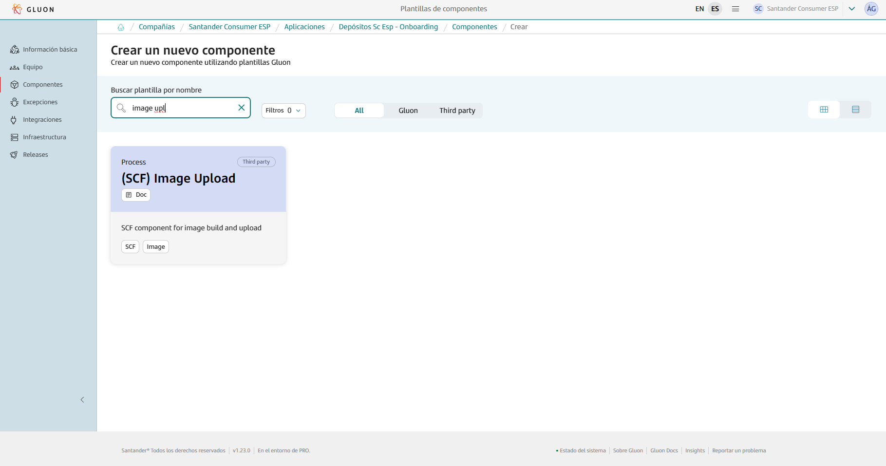
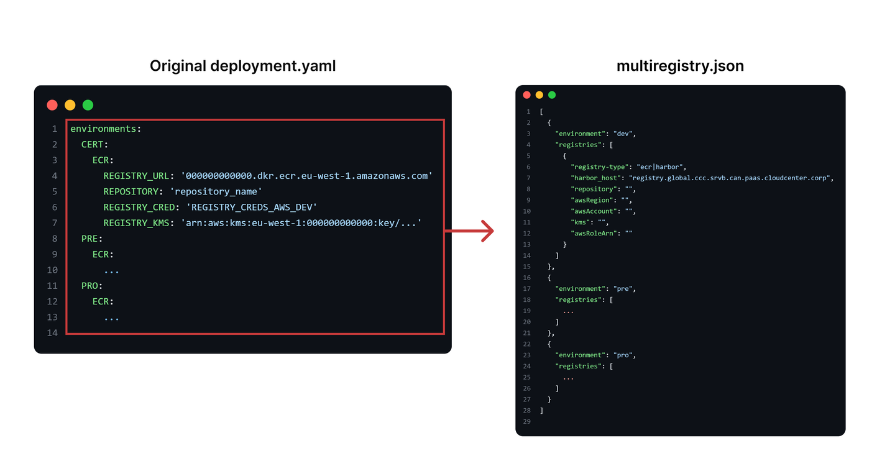

This page aims to assist in the migration of components that previously relied on the ALM Multicloud pipeline `pipelineForDockerLib` and `pipelineForDockerLibMulticluster` in Jenkins.
The guide focuses on the migration and adaptation of the GitHub repository files to comply with Gluon.
Full information about yo use this component template can be found in [documentation](https://gluon.gs.corp/community/docs/latest/local/local-references/scf/local-components/image-upload/).

## Prerequisites: AWS Credentials Request

For this pipeline to work correctly, you need to request a role + OIDC, which must be specified in the [awsRoleName](#deploymentyaml) parameter of the `multiregistry.json` file.
Note that this template is cataloged as a `Non Microservice components > ECR`, detailed information to make the request can be found [here](../../support/credentials/ecr.md).

## Create component in Gluon

When creating a component in Gluon it will automatically create a repository in `http://github.com` with the following naming convention: `acronym_company`**-**`acronym_application`**-**`short_name_component`.

- acronym-company: Length of 3 characters, this field comes from APM.
- acronym-application: Length of 7 characters, it will be requested in the application onboarding in Gluon.
- short-name-component Length of 16 characters, it will be requested when creating the component in Gluon.

In order to create the component go to your application in Gluon portal > Components > New Component and select `(SCF) Image Upload`.



When selecting the component to create, you will be prompted to enter the short-name-component and contact information for the maintainer.
The mandatory branch strategy for this template is *git flow*, which helps in managing the development workflow efficiently.
The *git-flow* branch strategy is explained indetail in [git-flow lifecycle](https://gluon.gs.corp/community/docs/latest/local/local-references/scf/local-components/ansible-execute/#gitflow-lifecycle).

Once the component is created, it will appear in the component list of your application followed by the used template, a short description and links to the GitHub repository.

The repository is created with a branch named `init-branch` that will run a scaffolding workflow to set up all required branches, environments and configuration files.
This workflow is expected to run automatically, so the expected behaviour is to find everything correctly configured.

???+ info "Scaffolding workflow"

    In some cases the scaffolding workflow will not run automatically. To solve this go to the Actions section of the repository and run the workflow manually from the *init-branch.*

## Repository migration

When scaffolding is executed, the repository will have this structure in the `development`branch, which must be respected for the workflow to work correctly:

```bash
📂.github
 ┣ 📂workflows
 | ┗ 📜ci.yml
 | ┣ 📜release.yml
 | ┣ 📜update-component-workflow.yml
 | ┗ 📜version-validation.yml
 ┗ 📜CODEOWNERS
📂.gluon
 ┣ 📂ci
 | ┗ 📜properties.env
📜Dockerfile
📜multiregistry.json
📜VERSION
```

You must take the source code of your component to the source repository  in the `development`branch and pay attention to the following adaptations:

### Ci-config.groovy to properties.env

Information from the file `ci-config.groovy` located at the root of the repository is transferred to the configuration file `properties.env` located in the `.gluon/ci/` folder.


Note that this is not a 1:1 migration and that there are new fields. Below is an example of `properties.env`:

- Set the `DOCKER_BUILD_ARGUMENTS=''` to the desired arguments for the image to build.

```yaml
DOCKER_BUILD_ARGUMENTS=''
```

### Deployment.yaml

The original `deployment.yml` file is transferred into the `multiregistry.json`, which is used to define the information for uploading images to the registry.

- Configuration of the `multiregistry.json`:



In the case of using **Harbor** as a registry, make sure to add `harbor_host` in the file and to have the secrets `HARBOR_USERNAME` and `HARBOR_PASSWORD` configured in the repository
(check the [Secrets Configuration](https://san-sc-we.atlassian.net/wiki/spaces/SCFCCOE/pages/edit-v2/682524691#%F0%9F%93%91--Secrets-Configuration) section for more info).
Find below an example of a multiregistry file with an AWS ECR case and Harbor examples:

```json
[
  {
    "environment": "dev",
    "registries": [
      {
        "registry-type":"ecr|harbor",
        "harbor_host": "registry.global.ccc.srvb.can.paas.cloudcenter.corp",
        "repository": "",
        "awsRegion":   "",
        "awsAccount": "",
        "kms": "",
        "awsRoleName": ""
      }
    ]
  },
  {
    "environment": "pre",
    "registries": [
      {
        "registry-type":"ecr|harbor",
        "harbor_host": "registry.global.ccc.srvb.can.paas.cloudcenter.corp",
        "repository": "",
        "awsRegion":   "",
        "awsAccount": "",
        "kms": "",
        "awsRoleName": ""
      }
    ]
  },
  {
    "environment": "pro",
    "registries": [
      {
        "registry-type":"[ecr|harbor]",
        "harbor_host": "registry.global.ccc.srvb.can.paas.cloudcenter.corp",
        "repository": "",
        "awsRegion":   "",
        "awsAccount": "",
        "kms": "",
        "awsRoleName": ""
      }
    ]
  }
]
```

### version.json → VERSION

The version of the `version.json` file located in the repository root is passed to the `VERSION` configuration file also in the repository root.


???+ info "Scaffolding workflow"

    It is important to note that “-SNAPSHOT” should not be added in Gluon, it is automatically added when the CI is launched in the development branch.

### Secrets Configuration

**Only if the image is uploaded to a Harbor** registry instead of AWS ECR a `HARBOR_USERNAME` and `HARBOR_PASSWORD` must be as secrets.

To do so, go to `Settings > Security > Secrets and variables > Actions` and add the following secrets at “Repository secrets” level.


