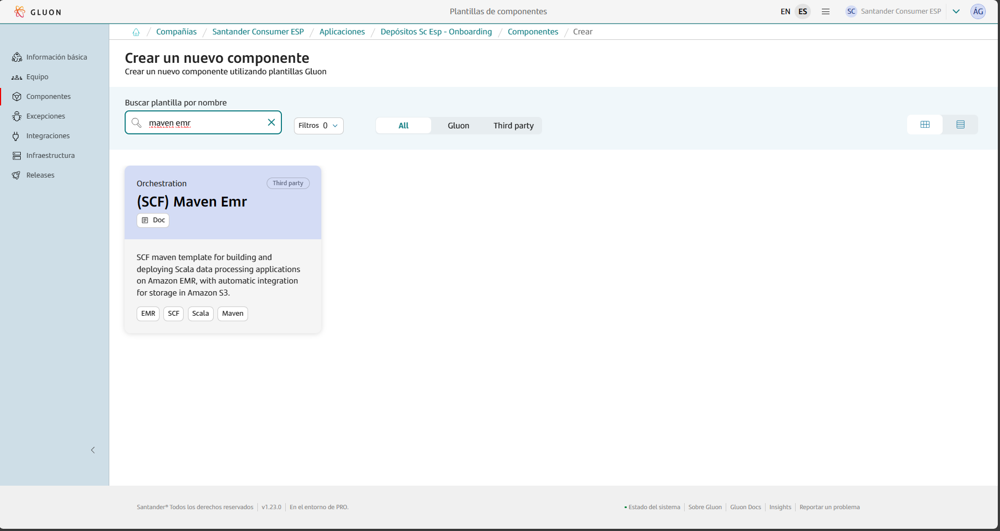
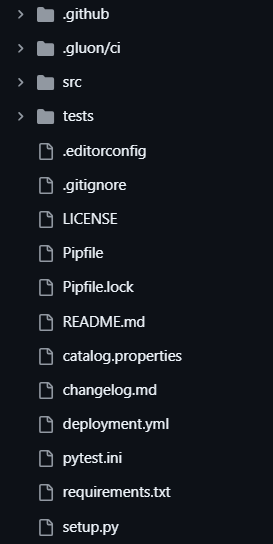
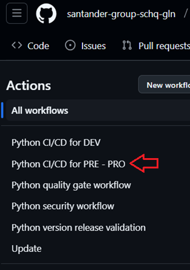
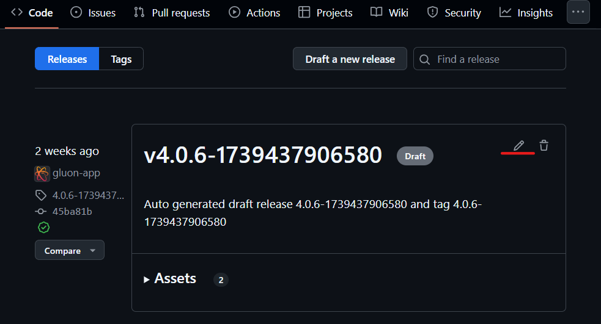

This page aims to assist in the migration of components that previously relied on the ALM Multicloud pipeline `pipelineForMavenEMR` in Jenkins.
The guide focuses on the migration and adaptation of the GitHub repository files to comply with Gluon.
Full information about how to use this component template can be found in [documentation](https://gluon.gs.corp/community/docs/latest/local/local-references/scf/local-components/maven-emr-micro/).

## Prerequisites: AWS Credentials Request

For this pipeline to work correctly, you need to request a role + OIDC.
Note that this template is cataloged as a `Non Microservice components > Miscellaneous`, detailed information to make the request can be found [here](../../support/credentials/data.md).

## Create component in Gluon

When creating a component in Gluon it will automatically create a repository in `http://github.com` with the following naming convention: `acronym_company`**-**`acronym_application`**-**`short_name_component`.

- acronym-company: Length of 3 characters, this field comes from APM.
- acronym-application: Length of 7 characters, it will be requested in the application onboarding in Gluon.
- short-name-component Length of 16 characters, it will be requested when creating the component in Gluon.

In order to create the component go to your application in Gluon portal > Components > New Component and select `(SCF) Maven EMR`.



When selecting the component to create, you will be prompted to enter the short-name-component and contact information for the maintainer.
The mandatory branch strategy for this template is *git flow*, which helps in managing the development workflow efficiently.
The *git-flow* branch strategy is explained indetail in [git-flow lifecycle](https://gluon.gs.corp/community/docs/latest/local/local-references/scf/local-components/ansible-execute/#gitflow-lifecycle).

Once the component is created, it will appear in the component list of your application followed by the used template, a short description and links to the GitHub repository.

The repository is created with a branch named `init-branch` that will run a scaffolding workflow to set up all required branches, environments and configuration files.
This workflow is expected to run automatically, so the expected behaviour is to find everything correctly configured.

???+ info "Scaffolding workflow"

    In some cases the scaffolding workflow will not run automatically. To solve this go to the Actions section of the repository and run the workflow manually from the *init-branch.*

## Repository and CI/CD

When scaffolding is executed, the repository will have this structure in the `development`branch, which must be respected for the workflow to work correctly:



To start working, create a new branch from the existing `development` branch that starts with `feature/` like `feature/init`, for example.

You can now add your source code to the new repository. Pay attention to the following information in order to make the GitHub Actions CI/CD workflows properly run.

### Git flow and CI/CD

In order to deploy to the target service or resource for each environment, follow the next steps.

#### Deploying process - DEV environment

- Create feature/my-branchfrom development branch.
- Make all the changes in the feature branch.
- To deploy to the DEV environment follow these steps.

- First create a Pull Request from feature/my-branch to development. This will trigger the following workflows.


- Wait until quality, security and version validation workflows end.
- Once the previous workflows have finished, if you merge the Pull Request, the CI/CD workflow will be executed automatically, deploying to the DEV environment.


???+ info "Note"

    You can deploy to the DEV environment even if Quality and Security gates fail. However it won't be possible to deploy to PRE or PRO environments if those workflows fail.

#### Deploying process - PRE environment

- Now that we have the source code in the development branch, the first step is creating a Pull Request from development to main.
- Quality, security and version validation workflows will be executed again, wait until they finish.


- Once the previous workflows have finished, if you merge the Pull Request, the CI/CD workflow will be automatically executed, but deploying to the PRE environment.



#### Deploying process - PRO environment

- Finally, in order to deploy to the PRO environment, the trigger is publishing a a GitHub Release.
- In the releases section of your repository, there should be an existing release generated automatically, similar to the one you can see in the following screenshot.



- Press the edit button (above the red mark) and then go to the bottom of the page, disable the “Set as pre-release” option and click on Set as the latest release. Then, click the publish release button.


- This will trigger the following CI/CD workflow that deploys to the PRO environment.


- If you don’t find an automatically generated release, you can always generate a new one by clicking the Draft a new release button and choosing the latest tag generated in the previous workflows.

## Relevant files in the repository

### Deployment.yaml file

You will have a deployment file with the following parameters. Set the values accordingly to the specified instructions and your specific needs.

```yaml
# Parameters for each environment. The comments written below for the DEV parameters also apply to the PRE and PRO environment parameters.
environments:
  DEV:
    AWS_ACCOUNT_ID: "111222333444"            # The ID of the AWS account where you want to deploy.
    S3BUCKET_NAME: "test"                     # s3://<S3BUCKET_NAME> - It must previously exist
    TARGET_FOLDER: "test"                     # s3://<S3BUCKET_NAME>/<TARGET_FOLDER> - If it doesn't exist, it will be created.
    OVERWRITE: 0                              # Set to 1 to replace everything located at s3://<S3BUCKET_NAME>/<TARGET_FOLDER>
    IS_PUBLIC: 0
    REGION: "eu-west-1"

  PRE:
    AWS_ACCOUNT_ID: "111222333444"
    S3BUCKET_NAME: ""
    TARGET_FOLDER: ""
    OVERWRITE: 0
    IS_PUBLIC: 0
    REGION: "eu-west-1"

  PRO:
    AWS_ACCOUNT_ID: "111222333444"
    S3BUCKET_NAME: ""
    TARGET_FOLDER: ""
    OVERWRITE: 0
    IS_PUBLIC: 0
    REGION: "eu-west-1"
    AWS_ACCOUNT_ID: "111222333444"
```

### pom.xml

This file is key since it contains information about the build process and the dependencies.

If you had a previous project with Scala, you can replace the entire pom.xml file and try the CI/CD workflows to check if compilation is correctly executed.

```xml
<!--
#######                            #######
        # SAMPLE VALUES - REPLACE #
#######                            #######
-->
<?xml version="1.0" encoding="UTF-8"?>
<project xmlns="http://maven.apache.org/POM/4.0.0"
         xmlns:xsi="http://www.w3.org/2001/XMLSchema-instance"
         xsi:schemaLocation="http://maven.apache.org/POM/4.0.0 http://maven.apache.org/xsd/maven-4.0.0.xsd">
    <modelVersion>4.0.0</modelVersion>

 <!--REPLACE with the groupId info of your component, like: schq.datalake, or supra.cleonalm...-->
 <groupId>com.santander.org.apm</groupId>
 <!--REPLACE with the artifactId for your component-->
    <artifactId>org-apm-component</artifactId>
 <name>org-apm-name-of-component</name>
 <description>Scala project built with MAVEN for AWS EMR Service</description>
    <version>1.0.0</version>
 <packaging>jar</packaging>

    <properties>
        <project.build.sourceEncoding>UTF-8</project.build.sourceEncoding>
        <scope>your-scope</scope>

  <!--REPLACE with the Scala specifications of your project-->
        <scala.version>2.12.15</scala.version>
        <scala.version.shortName>2.12</scala.version.shortName>
        <spark.version>3.4.1</spark.version>

    </properties>

    <dependencies>
 <!-- Basic Scala libraries -->
        <!-- Main Scala library -->
        <dependency>
            <groupId>org.scala-lang</groupId>
            <artifactId>scala-library</artifactId>
            <version>${scala.version}</version>
            <scope>provided</scope>
        </dependency>

        <dependency>
            <groupId>org.scala-lang</groupId>
            <artifactId>scala-library</artifactId>
            <version>${scala.version}</version>
            <scope>provided</scope>
        </dependency>

  <dependency>
            <groupId>org.apache.spark</groupId>
            <artifactId>spark-core_${scala.version.shortName}</artifactId>
            <version>${spark.version}</version>
            <scope>provided</scope>
        </dependency>

  <!--OTHER DEPENDENCIES -->
  <dependency>
   <groupId>org.projectlombok</groupId>
   <artifactId>lombok</artifactId>
   <scope>provided</scope>
  </dependency>

  <!-- Test -->
  <dependency>
   <groupId>org.springframework.boot</groupId>
   <artifactId>spring-boot-starter-test</artifactId>
   <exclusions>
    <exclusion>
     <groupId>org.springframework.boot</groupId>
     <artifactId>spring-boot-starter-logging</artifactId>
    </exclusion>
    <exclusion>
     <groupId>junit</groupId>
     <artifactId>junit</artifactId>
    </exclusion>
   </exclusions>
   <scope>test</scope>
  </dependency>
  <dependency>
   <groupId>org.junit.jupiter</groupId>
   <artifactId>junit-jupiter</artifactId>
   <scope>test</scope>
  </dependency>
  <dependency>
   <groupId>org.junit.platform</groupId>
   <artifactId>junit-platform-launcher</artifactId>
   <scope>test</scope>
  </dependency>
 </dependencies>

<!--
#######                            													#######
        #  REPLACE with the specific needs of you project to be properly built
#######                           													#######
-->
 <build>
     <sourceDirectory>src/main/scala</sourceDirectory>
     <finalName>${project.artifactId}-${project.version}</finalName>
     <!-- <finalName></finalName> -->
     <plugins>
         <!-- Scala compiler for Maven -->
         <plugin>
             <groupId>net.alchim31.maven</groupId>
             <artifactId>scala-maven-plugin</artifactId>
             <version>4.4.0</version>
             <executions>
                 <execution>
                     <goals>
                         <goal>compile</goal>
                         <!--<goal>testCompile</goal>-->
                     </goals>
                 </execution>
             </executions>
         </plugin>
         <!-- Generate JAR -->
         <plugin>
             <groupId>org.apache.maven.plugins</groupId>
             <artifactId>maven-shade-plugin</artifactId>
             <version>3.2.4</version>
             <executions>
                 <execution>
                     <phase>package</phase>
                     <goals>
                         <goal>shade</goal>
                     </goals>
                     <configuration>
                         <!--<finalName></finalName>-->
                         <shadedArtifactAttached>true</shadedArtifactAttached>
                         <createDependencyReducedPom>false</createDependencyReducedPom>
                         <shadedClassifierName>shaded</shadedClassifierName>
                     </configuration>
                 </execution>
             </executions>
         </plugin>
         <plugin>
             <groupId>org.apache.maven.plugins</groupId>
             <artifactId>maven-compiler-plugin</artifactId>
             <configuration>
                 <source>8</source> <!--REPLACE with a different version if required-->
                 <target>8</target> <!--REPLACE with a different version if required-->
             </configuration>
         </plugin>
     </plugins>
 </build>

 <reporting>
  <plugins>
   <plugin>
    <groupId>org.apache.maven.plugins</groupId>
    <artifactId>maven-project-info-reports-plugin</artifactId>
    <reportSets>
     <reportSet>
      <reports><!-- select reports -->
       <report>index</report>
      </reports>
     </reportSet>
    </reportSets>
   </plugin>
   <plugin>
    <groupId>org.apache.maven.plugins</groupId>
    <artifactId>maven-javadoc-plugin</artifactId>
    <configuration>
     <source>${java.version}</source>
     <additionalOptions>
      <option>--frames</option>
     </additionalOptions>
    </configuration>
    <reportSets>
     <reportSet><!-- by default, id = "default" -->
      <reports><!-- select non-aggregate reports -->
       <report>javadoc-no-fork</report>
      </reports>
     </reportSet>
     <reportSet><!-- aggregate reportSet, to define in poms having modules -->
      <id>aggregate</id>
      <inherited>true</inherited><!-- don't run aggregate in child modules -->
      <reports>
       <report>aggregate-no-fork</report>
      </reports>
     </reportSet>
    </reportSets>
   </plugin>
  </plugins>
 </reporting>

</project>
```

### properties.env

The only parameter you should change is JAVA_VERSION.

```yaml
# Sonar parameters
SONAR_ID="SONAR_GLUON_COMMUNITY"
SONAR_PROJECT_KEY=""

# Fortify parameters
FORTIFY_PROJECT=""

# Java version to build your project
JAVA_VERSION="adoptopenjdk-17.0.8+7"
```
