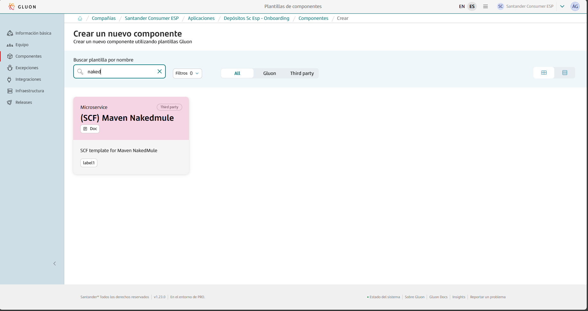

This page aims to assist in the migration of components that previously relied on the ALM Multicloud pipeline `pipelineForMavenNakedmule` in Jenkins.
The guide focuses on the migration and adaptation of the GitHub repository files to comply with Gluon.
Full information about yo use this component template can be found in [documentation](https://gluon.gs.corp/community/docs/latest/local/local-references/scf/local-components/).

## Create component in Gluon

When creating a component in Gluon it will automatically create a repository in `http://github.com` with the following naming convention: `acronym_company`**-**`acronym_application`**-**`short_name_component`.

- acronym-company: Length of 3 characters, this field comes from APM.
- acronym-application: Length of 7 characters, it will be requested in the application onboarding in Gluon.
- short-name-component Length of 16 characters, it will be requested when creating the component in Gluon.

In order to create the component go to your application in Gluon portal > Components > New Component and select `(SCF) Maven Nakedmule`.



When selecting the component to create, you will be prompted to enter the short-name-component and contact information for the maintainer.
The mandatory branch strategy for this template is *git flow*, which helps in managing the development workflow efficiently.
The *git-flow* branch strategy is explained indetail in [git-flow lifecycle](https://gluon.gs.corp/community/docs/latest/local/local-references/scf/local-components/ansible-execute/#gitflow-lifecycle).

Once the component is created, it will appear in the component list of your application followed by the used template, a short description and links to the GitHub repository.

The repository is created with a branch named `init-branch` that will run a scaffolding workflow to set up all required branches, environments and configuration files.
This workflow is expected to run automatically, so the expected behaviour is to find everything correctly configured.

???+ info "Scaffolding workflow"

    In some cases the scaffolding workflow will not run automatically. To solve this go to the Actions section of the repository and run the workflow manually from the *init-branch.*

## Repository migration

When scaffolding is executed, the repository will have this structure in the `development`branch, which must be respected for the workflow to work correctly:

```bash
📂.github
 ┣ 📂workflows
 | ┣ 📜cd.yml
 | ┣ 📜ci.yml
 | ┣ 📜quality.yml
 | ┣ 📜release.yml
 | ┣ 📜security.yml
 | ┣ 📜update-component-workflow.yml
 | ┗ 📜version-validation.yml
 ┗ 📜CODEOWNERS
📂.gluon
 ┣ 📂ci
 | ┗ 📜properties.env
📜configuration.json
📜deployment.yml
📜mule-artifact.json
📜pom.xml
```

You must take the source code of your component to the source repository  in the `development`branch and pay attention to the following adaptations:

### ci-config.groovy → properties.env

Information from the file `ci-config.groovy` located at the root of the repository is transferred to the configuration file `properties.env` located in the `.gluon/ci/` folder.


Note that this is not a 1:1 migration and that there are new fields. Below is an example of `properties.env`:

- The fields `FORTIFY_PROJECT` and `SONAR_PROJECT_KEY` are automatically filled during the scaffolding process.
- It's important to define `ARTIFACT_NATIVE_COMPILATION` if it is a `-Pnative` type build of Maven.
- You can customize `MAVEN_DEPLOY_ARGS` in this file.
- Select `MAVEN_VERSION` and `JAVA_VERSION` from the following versions:

Java versions:

- adoptopenjdk-8.0.442+6
- adoptopenjdk-11.0.26+4
- adoptopenjdk-17.0.14+7
- adoptopenjdk-21.0.6+7.0.LTS

```yaml
# Sonar parameters
SONAR_PROJECT_KEY=""

# Fortify parameters
FORTIFY_PROJECT=""

# JVM using to build the project
JAVA_VERSION="adoptopenjdk-17.0.8+7"
MAVEN_DEPLOY_ARGS=""

# Active native compilation
ARTIFACT_NATIVE_COMPILATION="false"
```

### configuration.json

Your configuration.json file can be kept as the original one:

```json
{
    "mule.agent.application.properties.service": {
        "applicationName": "<NAME>",
        "properties": {
        }
    }
}
```

### deployment.yaml

Your deployment.yaml file can be kept as the original one:

```yaml
CERT:
  API_URL_LOGIN: <API_URL_LOGIN>
  API_URL_APP: <API_URL_APP>
  API_CREDENTIAL_NAME: <API_CREDENTIAL_NAME>
  ENV_ID: <ENV_ID>
  ORG_ID: <ORG_ID>
  TARGET_ID: <ID>
PRE:
  API_URL_LOGIN: <API_URL_LOGIN>
  API_URL_APP: <API_URL_APP>
  API_CREDENTIAL_NAME: <API_CREDENTIAL_NAME>
  ENV_ID: <ENV_ID>
  ORG_ID: <ORG_ID>
  TARGET_ID: <ID>
PRO:
  API_URL_LOGIN: <API_URL_LOGIN>
  API_URL_APP: <API_URL_APP>
  API_CREDENTIAL_NAME: <API_CREDENTIAL_NAME>
  ENV_ID: <ENV_ID>
  ORG_ID: <ORG_ID>
  TARGET_ID: <ID>
```

### mule-artifact.json

Your mule-artifact.json file can be kept as the original one:

```json
{
    "minMuleVersion": "4.4.0"
}
```

### Secrets Configuration

In order to have your artifact uploaded to Nexus `NEXUS_USERNAME` and `NEXUS_PASSWORD` must be added as repository secrets within the repository.
To do so, go to `Settings > Security > Secrets and variables > Actions` and add the following secrets at “Repository secrets” level.

It’s also necessary to set  `CLIENT_ID` and `CLIENT_SECRET` as repository secrets.


