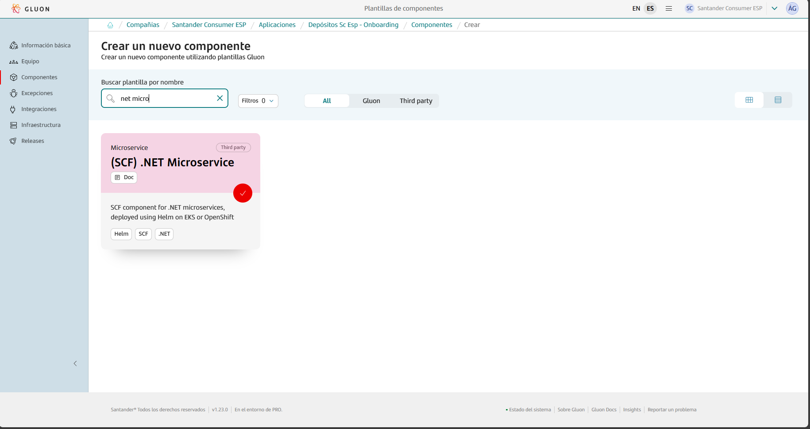
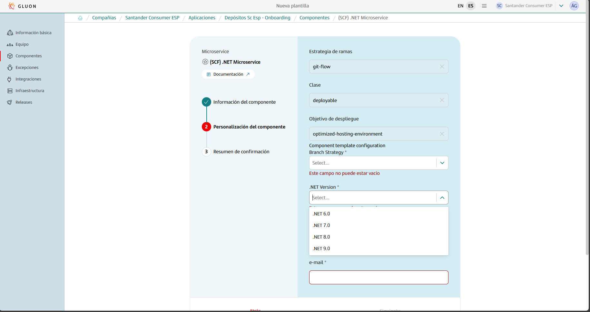
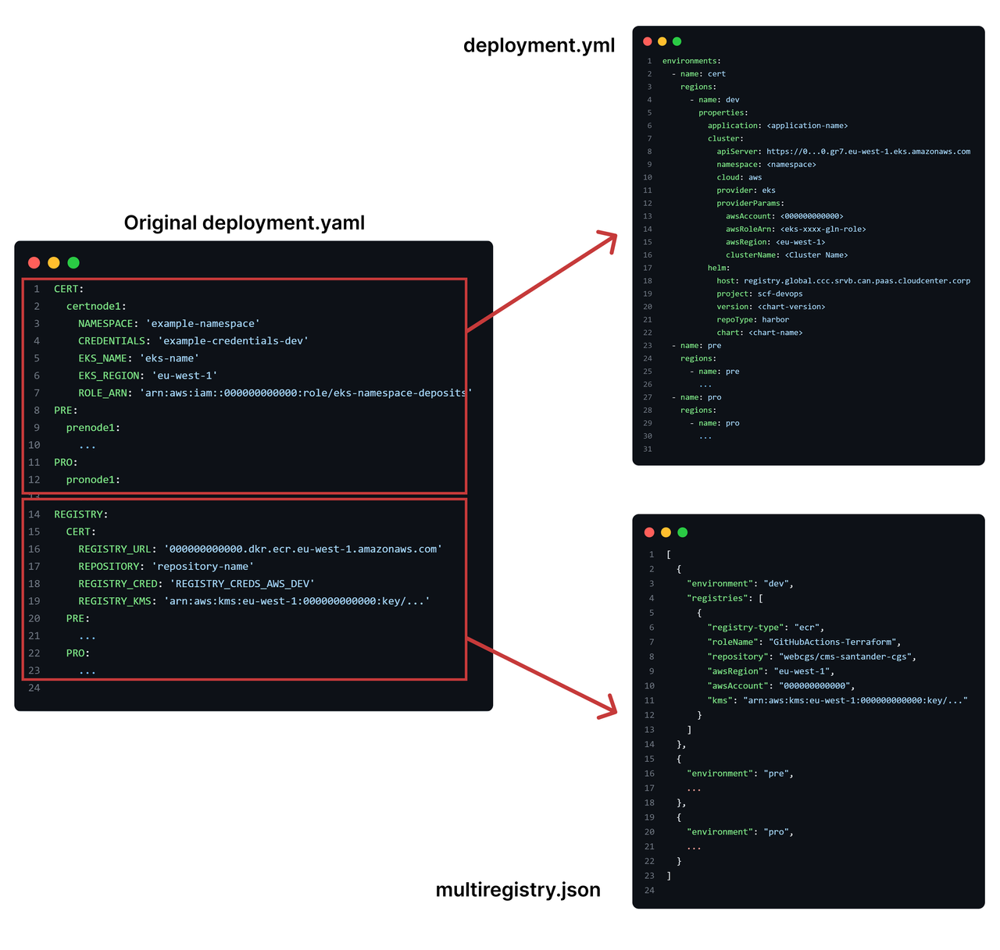
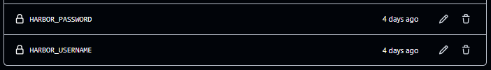

This page aims to assist in the migration of components that previously relied on the ALM Multicloud pipeline `pipelineForNETCOREDockerHelmEKS` in Jenkins.
The guide focuses on the migration and adaptation of the GitHub repository files to comply with Gluon.
Full information about yo use this component template can be found in [documentation](https://gluon.gs.corp/community/docs/latest/local/local-references/scf/local-components/dotnet-microservice/).

## Prerequisites: AWS Credentials Request

For this pipeline to work correctly, you need to request a role + OIDC, which must be specified in the `awsRoleName` parameter of the `multiregistry.json` file.
Note that this template is cataloged as a `Microservice components > Brownfield`, detailed information to make the request can be found [here](../../support/credentials/brownfield.md).

## Create component in Gluon

When creating a component in Gluon it will automatically create a repository in `http://github.com` with the following naming convention: `acronym_company`**-**`acronym_application`**-**`short_name_component`.

- acronym-company: Length of 3 characters, this field comes from APM.
- acronym-application: Length of 7 characters, it will be requested in the application onboarding in Gluon.
- short-name-component Length of 16 characters, it will be requested when creating the component in Gluon.

In order to create the component go to your application in Gluon portal > Components > New Component and select `(SCF) .NET Microservice`.





When selecting the component to create, you will be prompted to enter the short-name-component and contact information for the maintainer.
The mandatory branch strategy for this template is *git flow*, which helps in managing the development workflow efficiently.
The *git-flow* branch strategy is explained indetail in [git-flow lifecycle](https://gluon.gs.corp/community/docs/latest/local/local-references/scf/local-components/ansible-execute/#gitflow-lifecycle).

The following .NET versions are supported for building and deploying microservices using this template:

- **6.0.428**
- **7.0.410**
- **8.0.406**
- **9.0.200**

Once the component is created, it will appear in the component list of your application followed by the used template, a short description and links to the GitHub repository.

The repository is created with a branch named `init-branch` that will run a scaffolding workflow to set up all required branches, environments and configuration files.
This workflow is expected to run automatically, so the expected behaviour is to find everything correctly configured.

???+ info "Scaffolding workflow"

    In some cases the scaffolding workflow will not run automatically. To solve this go to the Actions section of the repository and run the workflow manually from the *init-branch.*

## Repository migration

When scaffolding is executed, the repository will have this structure in the `development` branch, which must be respected for the workflow to work correctly:

```bash
📂.chart
 ┣ 📜values-dev.yml
 ┣ 📜values-pre.yml
 ┣ 📜values-pro.yml
📂.github
 ┣ 📂workflows
 | ┣ 📜cd.yml
 | ┣ 📜ci.yml
 | ┣ 📜release.yml
 | ┣ 📜security.yml
 | ┣ 📜quality.yml
 | ┣ 📜update-component-workflow.yml
 | ┗ 📜version-validation.yml
 ┗ 📜CODEOWNERS
📂.gluon
 ┣ 📂ci
 | ┗ 📜properties.env
📜Dockerfile
📜deployment.yaml
📜multiregistry.json
📜VERSION
```

You must take the source code of your component to the source repository  in the `development`branch and pay attention to the following adaptations:

### ci-config.groovy → properties.env

Information from the file `ci-config.groovy` located at the root of the repository is transferred to the configuration file `properties.env` located in the `.gluon/ci/` folder.


In this caso there are nothing to copy from ci-config,The key `APP_NAME` in the `ci-config.groovy` file (in which it was necessary to write the name of the .sln at the root of the repository) is deprecated.

There is a new feature that is `PROJECT_PATH` key, which by default will take the `.sln` file from the root of the repository, but you can specify any path to any `.sln or .csproj` file in the repository.

- The fields `FORTIFY_PROJECT` and `SONAR_PROJECT_KEY` are automatically filled during the scaffolding process.

```yaml
# Sonar parameters
SONAR_ID="SONAR_GLUON_COMMUNITY"
SONAR_PROJECT_KEY=""

# Fortify parameters
FORTIFY_PROJECT=""

# .NET parameters
DOTNET_VERSION=""
PROJECT_PATH=""
```

### Deployment.yml → deployment.yml + multiregistry.json

The original `deployment.yml` file is split into two new files: the `deployment.yml` itself, which is used for deployment in the CD process, and the `multiregistry.json`, which is used to define the information for uploading images to the registry.



- Configuration of the `deployment.yml`:

???+ info "Note"

    **awsRoleName:** When using roles a `awsRoleName` under `providerParams` needs to be defined (the name of the role is expected and not the entire ARN).
    When using roles, if the pod needs credentials to consume AWS resources, it will also be necessary to reference `serviceAccountName` in the values files (check the [Values section](https://san-sc-we.atlassian.net/wiki/spaces/SCFCCOE/pages/edit-v2/682524691#%3Ainfo%3A-Values.yaml-para-Helm) for more information).

**EKS** Deployment example

```yaml
environments:
  - name: cert
    regions:
      - name: dev
        properties:
          application: <app-name>
          cluster:
            apiServer: <api-server-url>
            namespace: <namespace>
            provider: eks
            providerParams:
              awsAccount: <aws account id>
              awsRoleName: <role-to-assume>
              awsRegion: eu-west-1
              clusterName: <cluster-name>
          helm:
            host: registry.global.ccc.srvb.can.paas.cloudcenter.corp
            project: scf-devops
            version: <chart-version>
            repoType: harbor
            chart: <chart-name>
  - name: pre
  ...
```

**Openshift** OSE3 Example

```yaml
environments:
  - name: cert
    regions:
      - name: dev
        properties:
          application: <app-name>
          cluster:
            apiServer: <api-server-url>
            namespace: <namespace>
            provider: ose3
          helm:
            host: registry.global.ccc.srvb.can.paas.cloudcenter.corp
            project: scf-devops
            version: <chart-version>
            repoType: harbor
            chart: <chart-name>
  - name: pre
  ...
```

- Configuration of the `multiregistry.json`:

In the case of using **Harbor** as a registry, make sure to add `harbor_host` in the file and to have the secrets `HARBOR_USERNAME` and `HARBOR_PASSWORD` configured in the repository
(check the [Secrets Configuration](https://san-sc-we.atlassian.net/wiki/spaces/SCFCCOE/pages/edit-v2/682524691#%F0%9F%93%91--Secrets-Configuration) section for more info).
Find below an example of a multiregistry file with an AWS ECR case and Harbor examples:

```json
[
    {
      "environment": "dev",
      "registries": [
        {
            "registry-type":"ecr",
            "awsRegion":   "eu-west-1",
            "repository": "<ecr-repository-name>",
            "awsAccount": "<aws-account>",
            "kms": "<kms-key>"
        }
      ]
    },
    {
      "environment": "pre",
      "registries": [
        {
            "registry-type":"harbor",
            "harbor_host": "registry.global.ccc.srvb.can.paas.cloudcenter.corp",
            "repository": "repository-name/image-name"
        }
      ]
    },
     {
      "environment": "pro",
      "registries": [
        {
           ...
        }
      ]
    }
]
```

### Dockerfile

To migrate, we will keep the same `Dockerfile` changing the download of the artifact from Nexus to a COPY. Note that the previous Dockerfile used to download the artifact from Nexus as in the following example:

```dockerfile
ARG ARTIFACTURL_KANIKO
RUN curl -k -fLO ${ARTIFACTURL_KANIKO} && \
    xargs unzip && \
    rm -f *.zip
```

This download from Nexus is removed and changed to copy the files directly in your Dockerfile as follows:

```dockerfile
COPY . .
```

???+ info "Note"

    Pay attention to the `.dockerignore` which can prevent key files like node modules from being copied. It also allows unnecessary files not to be copied if they are added to the `.dockerignore`.

### version.json → VERSION

La versión del ficero `version.json` situado en la raiz del repositorio pasa al fichero de configuración `VERSION` también en la raíz del repositorio.


???+ info "Note"

    It is important to note that “-SNAPSHOT” should not be added in Gluon, it is automatically added when the CI is launched in the development branch.

### Values.yaml for Helm

In the file `deployment.yml`, we reference the chart that we want to use. In the following example, an excerpt from `deployment.yml` is shown where we reference the chart name and its version.

```yaml title="Deployment file excerpt referencing Helm Chart" linenums="1"
helm:
  host: registry.global.ccc.srvb.can.paas.cloudcenter.corp
  project: # chart template project
  version: # chart template version
  repoType: harbor
  chart: # chart template name
```

This chart is configured/customized using the `values-(env).yml` files explained below:

???+ info "Note"

    Files are stored in the repository under the .chart directory and are used to configure the Helm Chart that is parameterized to take them into account. There is a values file for each environment.

```yaml
.chart
| values-dev.yaml
| values-pre.yaml
| values-pro.yaml
```

Below is an example of `values-dev.yaml`:

???+ info "Note"

    **serviceAccountname:** If the pod needs credentials to consume AWS resources, it will be necessary to reference a `serviceAccountName`.

```yaml
image:
  repository: <image to use by the pod, ex.: 000000000000.dkr.ecr.eu-west-1.amazonaws.com/example/example>
  tag: <Image tag to use. ej.: 1.0.0-SNAPSHOT>

serviceAccountName: <*name of the serviceAccount for IRSA, if applicable>
microservice: <microservice name>
trackingCode: <tracking code>
hostName: <hostname>
secretTls: <TLS secret name to use>
namespace: <Namespace>
path: /
port: <port>
replicas: <pod replicas>

Secrets:
  - <Name of the secret to us>

configurationFiles:
  - name: <name>
    data: |-
      EXAMPLE: "example"
```

**What should be modified?**

These are the changes that have been added compared to the version being used

```yaml
serviceAccountName: <* name of the serviceAccount for IRSA, if applicable>
secretTls: <name of the secret>
namespace: <namespace within the cluster>
trackingCode: <tracking code>
```

Do the same for the `pre` and `pro` environments.

### Secrets Configuration

EKS deployments don’t require setting any credentials as secrets in your repository as authentication is done using roles.
**Only in Openshift** deployment cases a Token is required for each environment as GitHub Repository Secrets.

To do so, go to `Settings > Security > Secrets and variables > Actions` and add the following secrets at “Repository secrets” level.


**Only if the image is uploaded to a Harbor** registry instead of AWS ECR a `HARBOR_USERNAME` and `HARBOR_PASSWORD` must be as secrets:



### Code adaptation to use IRSA (if applicable)

IRSA (IAM Roles for Service Accounts)****should be used in scenarios where you would traditionally use user/password credentials to access AWS resources from within a pod.
By using IRSA, you enhance security by leveraging IAM roles and policies, thus avoiding the need to hardcode sensitive credentials in your application code.

[Use IRSA with the AWS SDK - Amazon EKS](https://docs.aws.amazon.com/eks/latest/userguide/iam-roles-for-service-accounts-minimum-sdk.html)

**Warning:**Ensure you are using IRSA when configuring your AWS SDK for Amazon EKS.
This is crucial for secure and efficient access management. It is essential for replacing traditional user/password methods when consuming AWS resources from within your pods.
