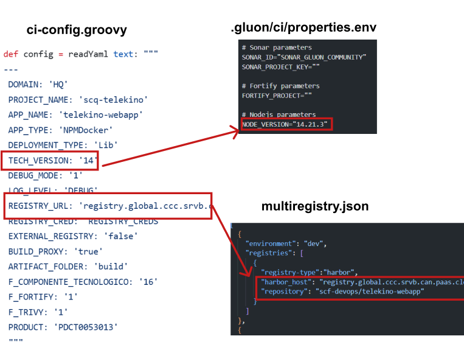

This page aims to assist in the migration of components that previously relied on the ALM Multicloud pipeline   `pipelineForNPMDockerLib` in Jenkins.
The guide focuses on the migration and adaptation of the GitHub repository files to comply with Gluon.
Full information about yo use this component template can be found in [documentation](https://gluon.gs.corp/community/docs/latest/local/local-references/scf/local-components/).

## Create component in Gluon

When creating a component in Gluon it will automatically create a repository in `http://github.com` with the following naming convention: `acronym_company`**-**`acronym_application`**-**`short_name_component`.

- acronym-company: Length of 3 characters, this field comes from APM.
- acronym-application: Length of 7 characters, it will be requested in the application onboarding in Gluon.
- short-name-component Length of 16 characters, it will be requested when creating the component in Gluon.

In order to create the component go to your application in Gluon portal > Components > New Component and select `(SCF) Node Image Upload`.

When selecting the component to create, you will be prompted to enter the short-name-component and contact information for the maintainer.
The mandatory branch strategy for this template is *git flow*, which helps in managing the development workflow efficiently.
The *git-flow* branch strategy is explained indetail in [git-flow lifecycle](https://gluon.gs.corp/community/docs/latest/local/local-references/scf/local-components/ansible-execute/#gitflow-lifecycle).

Once the component is created, it will appear in the component list of your application followed by the used template, a short description and links to the GitHub repository.

The repository is created with a branch named `init-branch` that will run a scaffolding workflow to set up all required branches, environments and configuration files.
This workflow is expected to run automatically, so the expected behaviour is to find everything correctly configured.

???+ info "Scaffolding workflow"

    In some cases the scaffolding workflow will not run automatically. To solve this go to the Actions section of the repository and run the workflow manually from the *init-branch.*

## Repository migration

When scaffolding is executed, the repository will have this structure in the `development`branch, which must be respected for the workflow to work correctly:

```bash
📂.github
 ┣ 📂workflows
 | ┣ 📜ci.yml
 | ┣ 📜release.yml
 | ┣ 📜security.yml
 | ┣ 📜quality.yml
 | ┣ 📜update-component-workflow.yml
 | ┗ 📜version-validation.yml
 ┗ 📜CODEOWNERS
📂.gluon
 ┣ 📂ci
 | ┗ 📜properties.env
📜Dockerfile
📜multiregistry.json
📜package.json
```

You must take the source code of your component to the source repository  in the `development`branch and pay attention to the following adaptations:

### ci-config.groovy → properties.env / multiregistry.json

Information from the file `ci-config.groovy` located at the root of the repository is transferred to the configuration file `properties.env` located in the `.gluon/ci/` folder and the `multiregistry.json`



Note that this is not a 1:1 migration and that there are new fields. Below is an example of `properties.env`:

- The fields `FORTIFY_PROJECT` and `SONAR_PROJECT_KEY` are automatically filled during the scaffolding process.
- It is important to define the `NPM_RUN_INSTALL_COMMAND`, `NPM_RUN_TEST_COMMAND`, and `NPM_RUN_TEST_COMMAND` that will be executed.
- In the `ci-config.groovy` file you had a `TECH VERSION`, turn it into `NODE_VERSION` from the following versions:

Available Node Versions

- 10.24.1
- 12.22.12
- 14.21.3
- 16.20.2
- 18.20.2
- 19.9.0
- 20.14.0

properties.env:

```yaml
# Sonar parameters
SONAR_ID="SONAR_GLUON_COMMUNITY"
SONAR_PROJECT_KEY=""

# Fortify parameters
FORTIFY_PROJECT=""

# Nodejs parameters
NODE_VERSION=""
```

### multiregistry.json

You must configure the multiregistry.json with the registry where you want to upload the image.

```json
[
  {
    "environment": "dev",
    "registries": [
      {
        "registry-type":"ecr|harbor",
        "harbor_host": "registry.global.ccc.srvb.can.paas.cloudcenter.corp",
        "repository": "",
        "awsRegion":   "",
        "awsAccount": "",
        "kms": "",
        "awsRoleName": ""
      }
    ]
  },
  {
    "environment": "pre",
    "registries": [
      {
        "registry-type":"ecr|harbor",
        "harbor_host": "registry.global.ccc.srvb.can.paas.cloudcenter.corp",
        "repository": "",
        "awsRegion":   "",
        "awsAccount": "",
        "kms": "",
        "awsRoleName": ""
      }
    ]
  },
  {
    "environment": "pro",
    "registries": [
      {
        "registry-type":"[ecr|harbor]",
        "harbor_host": "registry.global.ccc.srvb.can.paas.cloudcenter.corp",
        "repository": "",
        "awsRegion":   "",
        "awsAccount": "",
        "kms": "",
        "awsRoleName": ""
      }
    ]
  }
]
```

### Dockerfile

To migrate, we will keep the same `Dockerfile` changing the download of the artifact from Nexus to a COPY. Note that the previous Dockerfile used to download the artifact from Nexus as in the following example:

```dockerfile
ARG ARTIFACTURL_KANIKO
RUN curl -k -fLO ${ARTIFACTURL_KANIKO} && \
    xargs unzip && \
    rm -f *.zip
```

This download from Nexus is removed and changed to copy the files directly in your Dockerfile as follows:

```dockerfile
COPY . .
```

???+ info "Note"

    Pay attention to the `.dockerignore` which can prevent key files like node modules from being copied. It also allows unnecessary files not to be copied if they are added to the `.dockerignore`.

### version.json -> package.json

Now it is not necessary to indicate the version outside of the package.json.
The `package.json` file is a crucial component of any Node.js project.
It serves as the manifest file for the project, containing metadata relevant to the project such as the project name, **version**, description, main file, scripts, dependencies, and more.

Regarding the **version**, it’s now not necessary to define **SNAPSHOT** versions as it’s managed automatically.

### Secrets Configuration

**Only if the image is uploaded to a Harbor** registry instead of AWS ECR a `HARBOR_USERNAME` and `HARBOR_PASSWORD` must be as secrets.

To do so, go to `Settings > Security > Secrets and variables > Actions` and add the following secrets at “Repository secrets” level.


