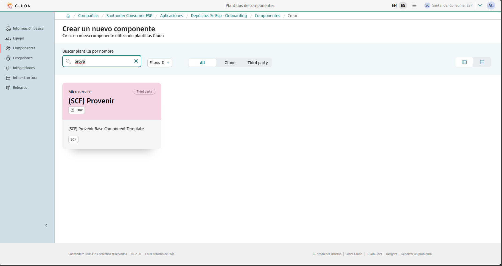
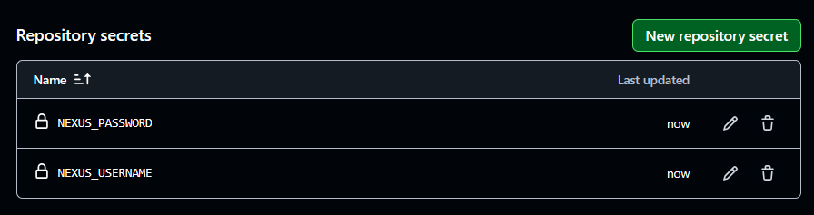
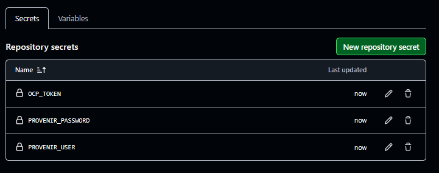

This page aims to assist in the migration of components that previously relied on the ALM Multicloud pipeline `pipelineForProvenir`.
The guide focuses on the migration and adaptation of the GitHub repository files to comply with Gluon.
Full information about yo use this component template can be found in [documentation](https://gluon.gs.corp/community/docs/latest/local/local-references/scf/local-components/provenir/).

## Create component in Gluon

When creating a component in Gluon it will automatically create a repository in `http://github.com` with the following naming convention: `acronym_company`**-**`acronym_application`**-**`short_name_component`.

- acronym-company: Length of 3 characters, this field comes from APM.
- acronym-application: Length of 7 characters, it will be requested in the application onboarding in Gluon.
- short-name-component Length of 16 characters, it will be requested when creating the component in Gluon.

In order to create the component go to your application in Gluon portal > Components > New Component and select `(SCF) Provenir`.



When selecting the component to create, you will be prompted to enter the short-name-component and contact information for the maintainer.
The mandatory branch strategy for this template is *git flow*, which helps in managing the development workflow efficiently.
The *git-flow* branch strategy is explained indetail in [git-flow lifecycle](https://gluon.gs.corp/community/docs/latest/local/local-references/scf/local-components/ansible-execute/#gitflow-lifecycle).

Once the component is created, it will appear in the component list of your application followed by the used template, a short description and links to the GitHub repository.

The repository is created with a branch named `init-branch` that will run a scaffolding workflow to set up all required branches, environments and configuration files.
This workflow is expected to run automatically, so the expected behaviour is to find everything correctly configured.

???+ info "Scaffolding workflow"

    In some cases the scaffolding workflow will not run automatically. To solve this go to the Actions section of the repository and run the workflow manually from the *init-branch.*

## Repository migration

When scaffolding is executed, the repository will have this structure in the `development`branch, which must be respected for the workflow to work correctly:

``` bash
📦
 ┣ 📂.github
 ┃ ┣ 📂workflows
 ┃ ┃ ┣ 📜cd.yml
 ┃ ┃ ┣ 📜ci.yml
 ┃ ┃ ┣ 📜quality.yml
 ┃ ┃ ┣ 📜release.yml
 ┃ ┃ ┣ 📜security.yml
 ┃ ┃ ┣ 📜update-component-workflow.yml
 ┃ ┃ ┗ 📜version-validation.yml
 ┃ ┗ 📜CODEOWNERS
 ┣ 📂.gluon
 ┃ ┣ 📂ci
 ┃ ┗ ┗ 📜properties.env
 ┣ 📜deployment.yml
 ┣ 📜VERSION
 ┗ 📜pom.xml
```

You must take the source code of your component to the source repository in the `development` branch and pay attention to the following adaptations:

### Configuration Files

This base component template works with some configuration files that may need some modifications from your original project:

- `properties.env`: Properties with the CI/CD configuration.
- `VERSION`: Version configuration file.
- `deployment.yml`: file to define the CD deploy procsess.
- `pom.xml`: Java configuration file.

#### Properties

The **properties.env** is a new file that contains the configuration settings for the CI/CD pipeline and is **generated automatically**.
This file includes essential parameters that are required for various stages of the pipeline, such as Sonar and Fortify project keys, Java version, and Maven deployment arguments.
By default, the file configures parameters like `SONAR_PROJECT_KEY`, `FORTIFY_PROJECT`, `JAVA_VERSION`, and `ARTIFACT_NATIVE_COMPILATION`.
These settings ensure that the pipeline has the necessary information to perform code quality checks, security scans, and build processes.

=== "Default"

    ```properties
        # Sonar parameters
        SONAR_PROJECT_KEY=""

        # Fortify parameters
        FORTIFY_PROJECT=""

        # JVM using to build the project
        JAVA_VERSION="adoptopenjdk-17.0.8+7"
        MAVEN_DEPLOY_ARGS=""

        # Active native compilation
        ARTIFACT_NATIVE_COMPILATION="false"

        # Maven additional parameters
        MAVEN_BUILD_GOAL=""
    ```

Additionally, the **properties.env** file includes detailed configurations for Sonar, such as the Sonar instance name, project key, report path, memory properties, and Elasticsearch settings.
These configurations are crucial for integrating SonarQube into the CI/CD pipeline, enabling comprehensive code analysis and reporting.
The naming convention for project names in Sonar and Fortify must match the component repository name to avoid errors. The file is generated with the necessary values for `SONAR_PROJECT_KEY` and `FORTIFY_PROJECT` to ensure consistency and accuracy.

#### VERSION File

The `VERSION` file is a simple text file that contains the version of the project. This file is used to track the current version of the project in a straightforward manner.

**Example of a `VERSION` file:**

```txt
1.0.0
```

**Customizing the `VERSION` file:**
Users using this template may need to update the version string to match their project's specifics. The version string should follow semantic versioning conventions, such as `MAJOR.MINOR.PATCH` (e.g., `1.0.0`).

If users already have a `VERSION` file, they can update the version string as needed to reflect the current state of their project.

#### Deployment.yaml

The `deployment.yaml` file is used to define the continuous deployment (CD) process for different environments.
This file specifies the necessary fields for each environment, ensuring that the deployment process is tailored to the specific requirements of each stage, such as CERT (certification), PRE (pre-production), and PRO (production).

This file remains unchanged from the original Jenkins pipeline as in the following example:

``` yaml
environments:
  CERT:
    NodeCERT1:
      repository_url:
      provenir_env: CERT
      project:
      provenir_credentials:
  PRE:
    NodePRE1:
      repository_url:
      provenir_env: PRE
      project:
      provenir_credentials:
      ocp_server:
      ocp_credentials:
      oc_project:
      oc_deployment:
    NodePRE2:
      repository_url:
      provenir_env: PRE
      project:
      provenir_credentials:
      ocp_server:
      ocp_credentials:
      oc_project:
      oc_deployment:
  PRO:
    NodePRO1:
      repository_url:
      provenir_env: PRO
      project:
      provenir_credentials:
      ocp_server:
      ocp_credentials:
      oc_project:
      oc_deployment:
    NodePRO2:
      repository_url:
      provenir_env: PRO
      project:
      provenir_credentials:
      ocp_server:
      ocp_credentials:
      oc_project:
      oc_deployment:
```

### Secrets Configuration

In order to have your artifact uploaded to Nexus `NEXUS_USERNAME` and `NEXUS_PASSWORD` must be added as repository secrets within the repository.

To do so, go to Settings > Security > Secrets and variables > Actions and add the following secrets at “Repository secrets” level.



It’s also necessary to set your openshift token as `OCP_TOKEN` as well as your provenir credentials as `PROVENIR_USER` and `PROVENIR_PASSWORD` that are used in the CD process to deploy.


