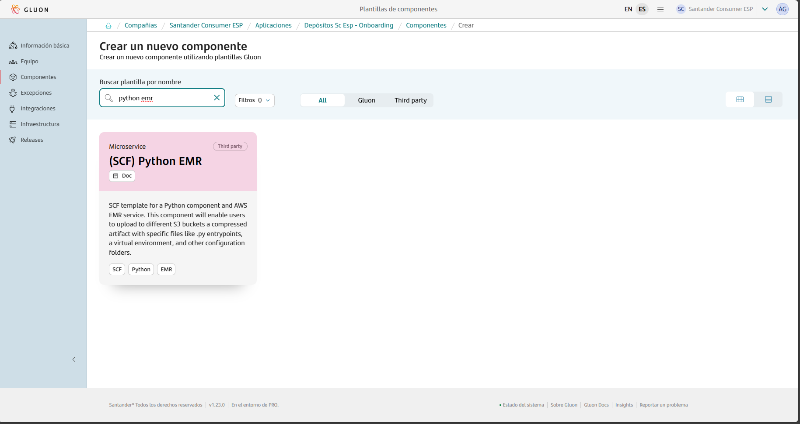

This page aims to assist in the migration of components that previously relied on the ALM Multicloud pipeline `pipelineForPythonEMR` in Jenkins.
The guide focuses on the migration and adaptation of the GitHub repository files to comply with Gluon.
Full information about how to use this component template can be found in [documentation](https://gluon.gs.corp/community/docs/latest/local/local-references/scf/local-components/python-emr/).

## Prerequisites: AWS Credentials Request

For this pipeline to work correctly, you need to request a role + OIDC.
Note that this template is cataloged as a `Non Microservice components > Miscellaneous`, detailed information to make the request can be found [here](../../support/credentials/data.md).

## Create component in Gluon

When creating a component in Gluon it will automatically create a repository in `http://github.com` with the following naming convention: `acronym_company`**-**`acronym_application`**-**`short_name_component`.

- acronym-company: Length of 3 characters, this field comes from APM.
- acronym-application: Length of 7 characters, it will be requested in the application onboarding in Gluon.
- short-name-component Length of 16 characters, it will be requested when creating the component in Gluon.

In order to create the component go to your application in Gluon portal > Components > New Component and select `(SCF) Python EMR`.



When selecting the component to create, you will be prompted to enter the short-name-component and contact information for the maintainer.
The mandatory branch strategy for this template is *git flow*, which helps in managing the development workflow efficiently.
The *git-flow* branch strategy is explained indetail in [git-flow lifecycle](https://gluon.gs.corp/community/docs/latest/local/local-references/scf/local-components/ansible-execute/#gitflow-lifecycle).

Once the component is created, it will appear in the component list of your application followed by the used template, a short description and links to the GitHub repository.

The repository is created with a branch named `init-branch` that will run a scaffolding workflow to set up all required branches, environments and configuration files.
This workflow is expected to run automatically, so the expected behaviour is to find everything correctly configured.

???+ info "Scaffolding workflow"

    In some cases the scaffolding workflow will not run automatically. To solve this go to the Actions section of the repository and run the workflow manually from the *init-branch.*

## Repository and CI/CD

When scaffolding is executed, the repository will have this structure in the `development`branch, which must be respected for the workflow to work correctly:


To start working, create a new branch from the existing `development` branch that starts with `feature/` like `feature/init`, for example.

You can now add your source code to the new repository. Pay attention to the following information in order to make the GitHub Actions CI/CD workflows properly run.

### Git flow and CI/CD

In order to deploy to the target service or resource for each environment, follow the next steps.

#### Deploying process - DEV environment

- Create feature/my-branchfrom development branch.
- Make all the changes in the feature branch.
- To deploy to the DEV environment follow these steps:
- First create a Pull Request from feature/my-branch to development. This will trigger the following workflows


- Wait until quality, security and version validation workflows end.
- Once the previous workflows have finished, if you merge the Pull Request, the CI/CD workflow will be executed automatically, deploying to the DEV environment.


???+ info "Note"

    You can deploy to the DEV environment even if Quality and Security gates fail. However it won't be possible to deploy to PRE or PRO environments if those workflows fail.

#### Deploying process - PRE environment

- Now that we have the source code in the development branch, the first step is creating a Pull Request from development to main.
- Quality, security and version validation workflows will be executed again, wait until they finish.


- Once the previous workflows have finished, if you merge the Pull Request, the CI/CD workflow will be automatically executed, but deploying to the PRE environment.


#### Deploying process - PRO environment

- Finally, in order to deploy to the PRO environment, the trigger is publishing a a GitHub Release.
- In the releases section of your repository, there should be an existing release generated automatically, similar to the one you can see in the following screenshot:


- Press the edit button (above the red mark) and then go to the bottom of the page, disable the “Set as pre-release” option and click on Set as the latest release. Then, click the publish release button.


- This will trigger the following CI/CD workflow that deploys to the PRO environment.


- If you don’t find an automatically generated release, you can always generate a new one by clicking the Draft a new release button and choosing the latest tag generated in the previous workflows.

## Relevant files in the repository

### Deployment.yaml file

You will find a deployment file with the following parameters. Set the values accordingly to the specified instructions and your specific needs.

Based on certain values the workflow will behave differently, in an effort of making this Python EMR component more adaptable and reduce the amount of components required.

- If you set these two values instead of letting them empty or commented out, the workflow will generate a virtual environment and upload it to the specified S3.

```yaml
    VENV_S3: "my-bucket"
    VENV_TARGET_FOLDER: "my/target/folder"
```

- If you set these three values instead of letting them empty or commented out, the workflow will generate upload to the S3 the specified folders in CONFIG_FOLDER_NAME.

```yaml
    CONFIG_S3: "my-bucket"
    CONFIG_TARGET_FOLDER: "test3"
    CONFIG_FOLDER_NAME: "src/folder1 src/folder2 ..."
```

```yaml
# Parameters for each environment. The comments written below for the DEV parameters also apply to the PRE and PRO environment parameters.
environments:
  DEV:
    AWS_ACCOUNT_ID: 001122334455                      # The ID of the AWS account where you want to deploy.
    S3BUCKET_NAME: "my-bucket"                        # s3://<S3BUCKET_NAME> - It must previously exist
    TARGET_FOLDER: "test"                             # s3://<S3BUCKET_NAME>/<TARGET_FOLDER> - If it doesn't exist, it will be created.
    COMPRESS_FOLDER: "src"                            # The specific directory that will be compressed. If the value is empty, the whole repository will be compressed.
    COMPRESS_FILE_NAME: "source-code"                 # s3://<S3BUCKET_NAME>/<TARGET_FOLDER>/<COMPRESS_FILE_NAME>.zip
    FILES_FOR_S3: "src/main.py src/core.py ..."       # Route to specific files in the project that will also be uploaded to s3://<S3BUCKET_NAME>/<TARGET_FOLDER>/main.py && s3://<S3BUCKET_NAME>/<TARGET_FOLDER>/core.py
    OVERWRITE: 0                                      # Set to 1 to replace everything located at s3://<S3BUCKET_NAME>/<TARGET_FOLDER>
    IS_PUBLIC: 0
    AWS_REGION: "eu-west-1"
    # Optional: Let these values empty/commented out if you don't need to upload a virtual environment.
    VENV_S3: "my-bucket"                              # - OPTIONAL! - s3://<VENV_S3> - It must previously exist
    VENV_TARGET_FOLDER: "test2"                       # - OPTIONAL! - s3://<VENV_S3>/<VENV_TARGET_FOLDER> - If it doesn't exist, it will be created.
    # Optional: Let these value empty/commented out if you don't need to upload folders with configs, json, yaml...(they are uploaded UNCOMPRESSED)
    CONFIG_S3: "my-bucket"                            # - OPTIONAL! - s3://<CONFIG_S3> - It must previously exist
    CONFIG_TARGET_FOLDER: "test3"                     # - OPTIONAL! - s3://<CONFIG_S3>/<CONFIG_TARGET_FOLDER> - If it doesn't exist, it will be created.
    CONFIG_FOLDER_NAME: "src/folder1 src/folder2 ..." # - OPTIONAL! - s3://<CONFIG_S3>/<CONFIG_TARGET_FOLDER>/config_folder - Specify the path to the config folders in your repository. If it's in the root of the project, just specify the folder name.

  PRE:
    AWS_ACCOUNT_ID: 001122334455
    S3BUCKET_NAME: "my-bucket"
    TARGET_FOLDER: "test"
    COMPRESS_FOLDER: "src"
    COMPRESS_FILE_NAME: "test_compress_file_name"
    FILES_FOR_S3: "src/__init__.py src/main.py"
    OVERWRITE: 0
    IS_PUBLIC: 0
    AWS_REGION: "eu-west-1"

    VENV_S3: "my-bucket"
    VENV_TARGET_FOLDER: "test2"

    CONFIG_FOLDER_NAME: "JSONCONFIG"
    CONFIG_S3: "my-bucket"
    CONFIG_TARGET_FOLDER: "test3"

  PRO:
    AWS_ACCOUNT_ID: 001122334455
    S3BUCKET_NAME: "trascribetestbucket"
    TARGET_FOLDER: "test"
    COMPRESS_FOLDER: "src"
    COMPRESS_FILE_NAME: "test_compress_file_name"
    FILES_FOR_S3: "src/helpers.py src/main.py"
    OVERWRITE: 0
    IS_PUBLIC: 0
    AWS_REGION: "eu-west-1"

    VENV_S3: "trascribetestbucket"
    VENV_TARGET_FOLDER: "test2"

    CONFIG_FOLDER_NAME: "JSONCONFIG"
    CONFIG_S3: "trascribetestbucket"
    CONFIG_TARGET_FOLDER: "test3"
```

- To achieve synchronization of the entire `src` directory, set `FILES_FOR_S3: "-r src/*"`. Similarly, you can use this approach with other folders as needed.

### Setup.py

This file contains metadata about the python project. You can set the values for the different parameters,
taking into account that each time you want to deploy to PRE or PRO environment, the version must be higher than the previous one deployed to PRE or PRO environment.

There is no need to change the version to deploy to the DEV environment.

```python
import setuptools

with open("README.md", "r") as fh:
    long_description = fh.read()

setuptools.setup(
    name="testpythonlibraryccoe",
    version="1.0.0",
    author="Jonh Doe",
    author_email="jonhdoe@mail.com",
    description="Python repository to do very cool stuff",
    long_description=open("README.md").read(),
    long_description_content_type="text/markdown",
    url="http://mypythoncomponent.com",
    packages=setuptools.find_packages(),
    classifiers=[
        "Programming Language :: Python :: 3",
        "License :: OSI Approved :: MIT License",
        "Operating System :: OS Independent",
    ],
    install_requires=[
    ],
    python_requires='>=3.9',
)
```

### Requirements.txt

The original file only contains one library called `requests`. You can modify this file and add different libraries your project requires, for example:

```yaml
apache-airflow==2.2.2
boto3>=1.23.9
paramiko>=2.9.5
pysftp==0.2.9
apache-airflow-providers-ssh>=2.1.0
apache-airflow-providers-amazon>=6.0.0
acelafw>=0.0.1
```

### Properties.env file

```adf
{"type":"paragraph","content":[{"text":"This file is located inside .gluon/ci directory. The ","type":"text"},{"text":"only parameter","type":"text","marks":[{"type":"backgroundColor","attrs":{"color":"#fedec8"}}]},{"text":" that should be modified is PYTHON_REQUIRES, adjusting the value to the python version for the virtual environment.","type":"text"}]}
```

```yaml
# Sonar parameters
SONAR_ID="SONAR_GLUON_COMMUNITY"
SONAR_PROJECT_KEY=""

# Fortify parameters
FORTIFY_PROJECT=""

# Python version. Specify the version between double quotation marks: "3.9"
PYTHON_REQUIRES="3.9"
```
