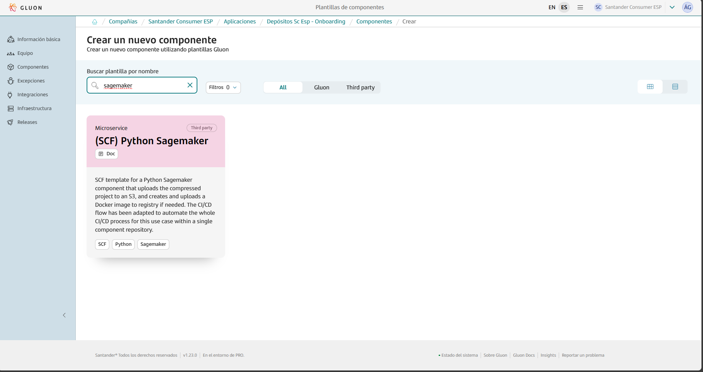
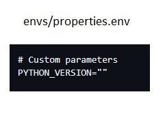
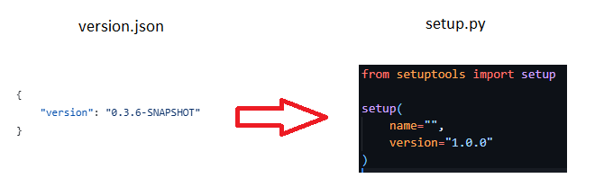
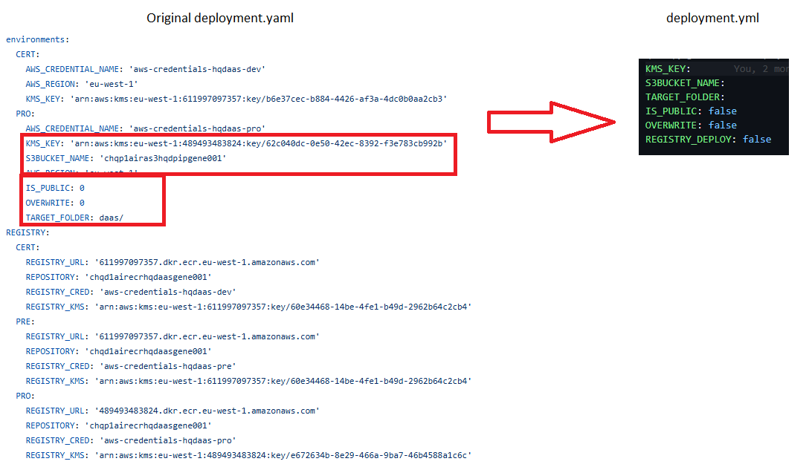
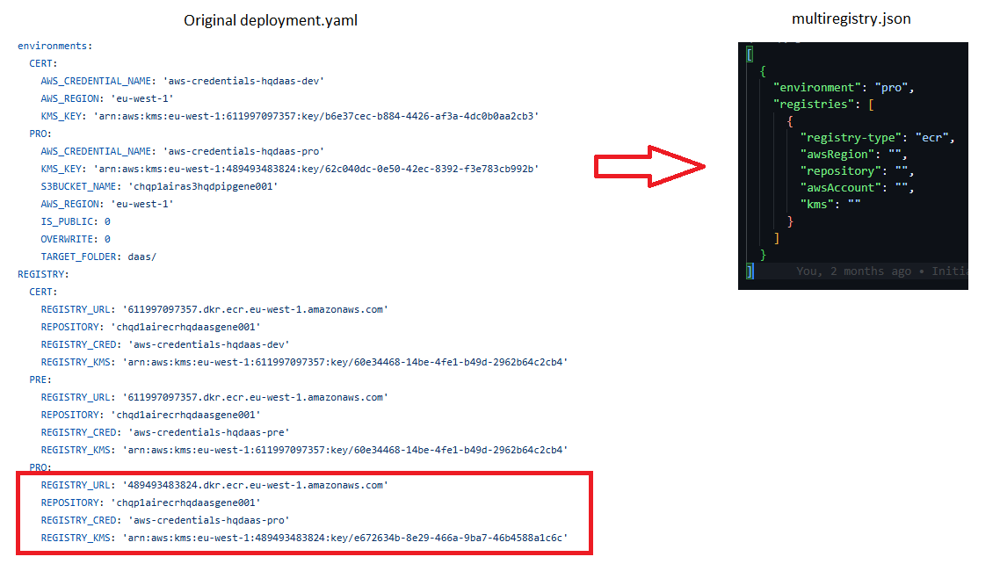
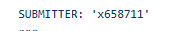
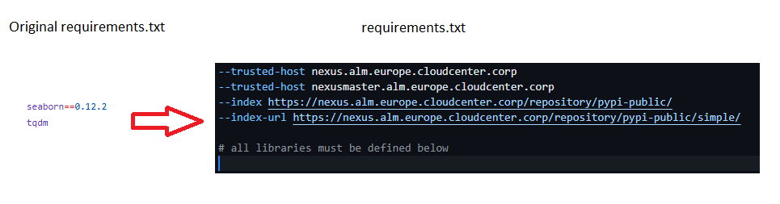
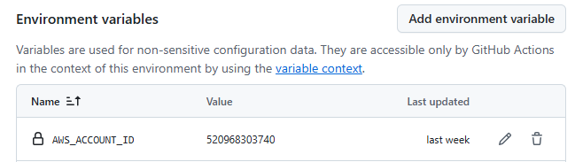
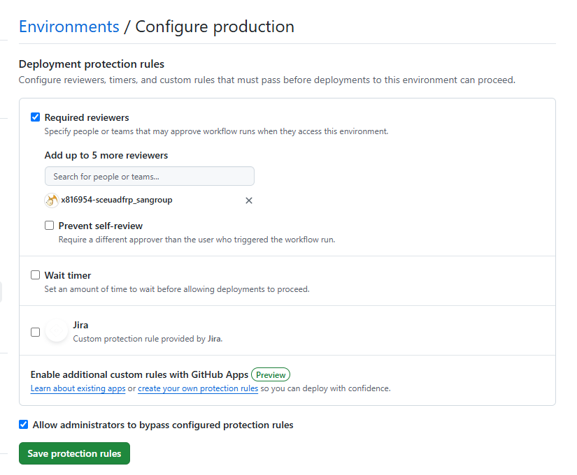

This page aims to assist in the migration of components that previously relied on the ALM Multicloud pipeline `pipelineForPythonSagemaker` in Jenkins.
The guide focuses on the migration and adaptation of the GitHub repository files to comply with Gluon.
Full information about to use these component templates can be found in the following documentations: [(SCF) Python Sagemaker](https://gluon.gs.corp/community/docs/latest/local/local-references/scf/local-components/python-sagemaker/).

## Prerequisites: AWS Credentials Request

For this pipeline to work correctly, you need to request a role + OIDC.
Note that this pipeline requires special attention so make sure to read [this section](../../support/credentials/special.md).

## Create component in Gluon

When creating a component in Gluon it will automatically create a repository in `http://github.com` with the following naming convention: `acronym_company`**-**`acronym_application`**-**`short_name_component`.

- acronym-company: Length of 3 characters, this field comes from APM.
- acronym-application: Length of 7 characters, it will be requested in the application onboarding in Gluon.
- short-name-component Length of 16 characters, it will be requested when creating the component in Gluon.

In order to create the component go to your application in Gluon portal > Components > New Component and select `(SCF) Python Sagemaker`.



When selecting the component to create, you will be prompted to enter the short-name-component and contact information for the maintainer.
The mandatory branch strategy for this template is *git flow*, which helps in managing the development workflow efficiently.
The *git-flow* branch strategy is explained indetail in [git-flow lifecycle](https://gluon.gs.corp/community/docs/latest/local/local-references/scf/local-components/ansible-execute/#gitflow-lifecycle).

Once the component is created, it will appear in the component list of your application followed by the used template, a short description and links to the GitHub repository.

The repository is created with a branch named `init-branch` that will run a scaffolding workflow to set up all required branches, environments and configuration files.
This workflow is expected to run automatically, so the expected behaviour is to find everything correctly configured.

???+ info "Scaffolding workflow"

    In some cases the scaffolding workflow will not run automatically. To solve this go to the Actions section of the repository and run the workflow manually from the *init-branch.*

## Repository migration

When scaffolding is executed, the repository will have this structure in the `development`branch, which must be respected for the workflow to work correctly:

```bash
📦
 ┣ 📂envs
 ┃ ┣ 📜properties.env
 ┣ 📂.github
 ┃ ┣ 📂workflows
 ┃ ┃ ┣ 📜python-sagemaker-cd.yml
 ┃ ┃ ┣ 📜python-sagemaker-ci.yml
 ┃ ┃ ┣ 📜python-sagemaker-quality.yml
 ┃ ┃ ┣ 📜python-sagemaker-rl.yml
 ┃ ┃ ┗ 📜python-sagemaker-security.yml
 ┃ ┗ 📜CODEOWNERS
 ┣ 📂src
 ┃ ┗ your code
 ┣ 📂resources
 ┃ ┗ optional resource files
 ┣ 📜deployment.yaml
 ┣ 📜requirements.txt
 ┣ 📜setup.py
 ┗ 📜README.md
```

You must take the source code of your component to the source repository in the `development`branch and pay attention to the following adaptations:

### properties.env

In this file, the variable **PYTHON_VERSION**must be set to the version of the python to use.



Available Python versions

- 3.10.11
- 3.11.5
- 3.9.18

```yaml
# Sonar parameters
SONAR_ID="SONAR_GLUON_COMMUNITY"
SONAR_PROJECT_KEY=""

# Fortify parameters
FORTIFY_PROJECT=""

# Quality parameters
QG_ENABLED="None"

# Define python version
PYTHON_VERSION=""
```

### setup.py → setup.py

The version of the `version.json` file located in the root folder is now set in the `version` field in the setup.py, also located in the root folder. And the rest of the **setup( )**block can be copied to the new setup.py file.



???+ info "Note"

    It is important that in Gluon, the suffix “-SNAPSHOT“ must not be added manually, it will be added automatically during workflow execution.

### Dockerfile → resources/Dockerfile

The content of the Dockerfle must be copied.

### Deployment.yaml → deployment.yml

The content of the original `deployment.yaml`file is reduced.



### Deployment.yaml → resources/multiregistry.json

The Registry PRO block of the deployment.yaml MUST be transformed to the new multiregistry.json file.

- **awsRegion**: eu-west-1
- **repository**: is the value of the variable **REPOSITORY**
- **awsAccount**: is the AWS account id that appears in the **REGISTRY_URL**
- **kms**: is the value of the variable **REGISTRY_KMS**



???+ info "Note"

    If do not want to lose information, the blocks CERT and PRE can be transformed too, and adding them to multiregistry.json.

### ci-config.groovy → deployment.yml

The value of the variable `REGISTRY_DEPLOY` depends on the value of the variable `ECR_REGISTRY` located in the ci-config.groovy file, if the value is “0”, then the new value is false.



???+ info "Note"

    If the the value of `REGISTRY_DEPLOY` is **true**, the files, Dockerfile and multiregistry.json, from the folder **resources**must be copied to the root folder, if not, leave them in the resources folder.

### src/requirements.txt → requirements.txt

If the original `requirements.txt` file does not have content related to Nexus hosts, those lines must be copied to the new `requirements.txt` with the hosts.



### Secrets Configuration

The deployments doesn't require setting any credentials as secrets in your repository as authentication is done using roles.

To enable the deployment, environment variables must be set, in this case, the AWS account id, to do so, go to `Settings > Code and automation > Environments`select the **production**environment,
and add the following variable, `AWS_ACCOUNT_ID`, at “Environment variables“ section.



### ci-config.groovy → Repository settings

If in the ci-config.groovy file has the variable **SUBMITTER**defined, the value of the variable must be added as a reviewer for the production environment.


To add a new reviewer for an environment, go to `Settings > Code and automation > Environments` select he **production**environment, activate the checkbox “**Required reviewers**“ if not activated,
add the value of the SUBMITTER in the textbox to add the user and click on the “**Save protection rules**” button to finish.


