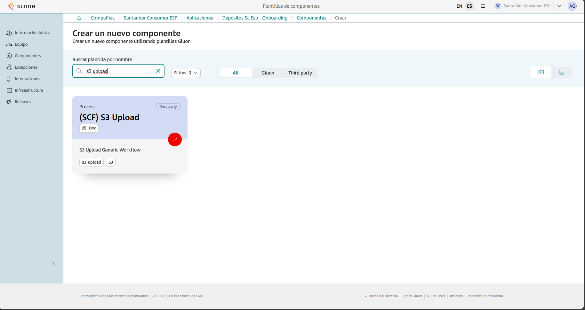
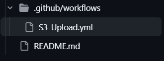
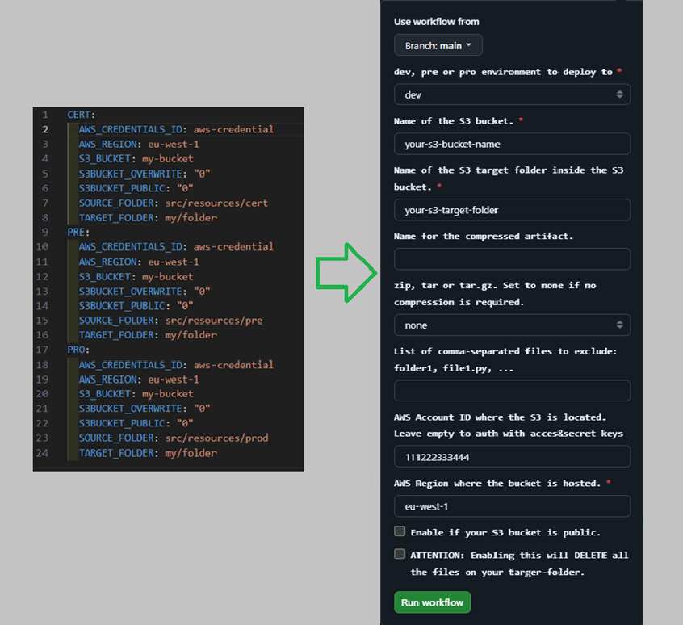
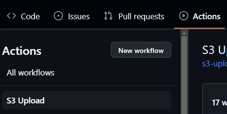
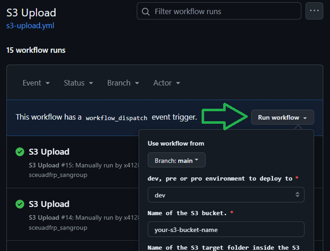
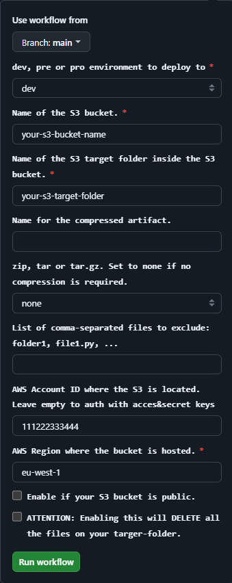

This page aims to assist in the migration of components that previously relied on the ALM Multicloud pipeline `pipelineForFilesUploadS3`in Jenkins.
The guide focuses on the migration and adaptation of the GitHub repository files to comply with Gluon.
Full information about to use this component template can be found in the gluon [documentation](https://gluon.gs.corp/community/docs/latest/local/local-references/scf/local-components/s3-upload/).

## Prerequisites: AWS Credentials Request

For this pipeline to work correctly, you need to request a role + OIDC.
Note that this template is cataloged as a `Non Microservice components > Miscellaneous`, detailed information to make the request can be found [here](../../support/credentials/data.md).

The S3 bucket must already exist in the account prior to execution.
This pipeline does not create the S3 bucket; it is intended solely to upload or synchronize its contents.

## Create component in Gluon

When creating a component in Gluon it will automatically create a repository in `http://github.com` with the following naming convention: `acronym_company`**-**`acronym_application`**-**`short_name_component`.

- acronym-company: Length of 3 characters, this field comes from APM.
- acronym-application: Length of 7 characters, it will be requested in the application onboarding in Gluon.
- short-name-component Length of 16 characters, it will be requested when creating the component in Gluon.

In order to create the component go to your application in Gluon portal > Components > New Component and select `(SCF) S3 Upload`.

When selecting the component to create, you will be prompted to enter the short-name-component and contact information for the maintainer.
The mandatory branch strategy for this template is *git flow*, which helps in managing the development workflow efficiently.
The *git-flow* branch strategy is explained indetail in [git-flow lifecycle](https://gluon.gs.corp/community/docs/latest/local/local-references/scf/local-components/ansible-execute/#gitflow-lifecycle).

Once the component is created, it will appear in the component list of your application followed by the used template, a short description and links to the GitHub repository.

The repository is created with a branch named `init-branch` that will run a scaffolding workflow to set up all required branches, environments and configuration files.
This workflow is expected to run automatically, so the expected behaviour is to find everything correctly configured.

???+ info "Scaffolding workflow"

    In some cases the scaffolding workflow will not run automatically. To solve this go to the Actions section of the repository and run the workflow manually from the *init-branch.*

## Workflow and usage

The new component for S3 Upload is completely different from the previous jenkins pipeline and other workflows and components.

When scaffolding is executed, the repository will have this structure in the `development` branch, which must be respected for the workflow to work correctly:

That is the only workflow that will handle the upload of the files you specify. Apart from the workflow and the README file, the rest of the files of your own project must be included or created.

In the past, in order to use the Jenkins pipeline, you had to configure the ci-config.groovy and the deployment.yaml file.

For the (SCF) S3 Upload components, you only need to do two things:

- Create or add the files of your project.
- Manually execute the workflow setting the values for the available inputs

Here is a comparative:

In order to get to that box on the right, you have to follow these steps:

- Go to Actions tab on the to of your repository

- Click on the S3 Upload workflow on the left side and then click Run workflow.

Once you are there, now you can specify the values for every input available. Here is an explanation of every input.

- The environment where the S3 you want to deploy to is located.
- The name of the S3 bucket. Previously S3_BUCKET in the deployment.yml file.
- The target folder inside the S3 bucket. Previously TARGET_FOLDER in the deployment.yaml file.
- With the input “Name for the compressed artifact” you can set a custom name for your compressed artifact. If you don’t want to generate a compressed artifact, leave the value empty.
- Choose one of the available compression formats or select `none` if no compression is required at all.
- The next parameter is where you can specify files or directories you dont want to upload to the S3 bucket. The default behaviour is uploading all the repository files or compressing all the repository files in the .zip|.tar|.tar.gz format you indicated.
- Under AWS Account ID, you have to set the specific ID of the AWS account where your S3 bucket is located.
- The AWS region, found as AWS_REGION parameter previously.
- And finally, the S3BUCKET_PUBLIC and S3BUCKET_OVERWRITE parameters are in this case two boxes you can mark in order to enable or disable them.

Once all the values are correctly set, you can click `Run workflow`in order to start the deployment.
