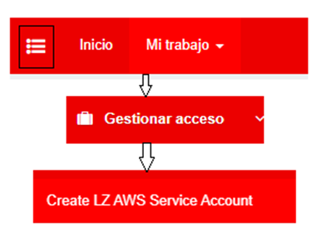
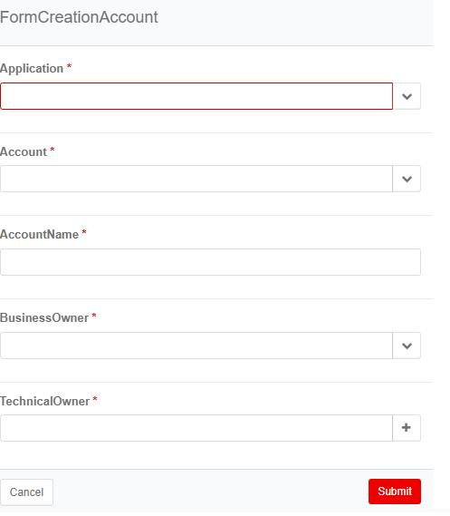

Guide to be followed by components created from Gluon's Greenfield templates for microservices:

- [Darwin Microfront](https://gluon.gs.corp/community/docs/latest/components/software/front/web/darwin/mfe/)
- [Darwin NodeJS Microservice](https://gluon.gs.corp/community/docs/latest/components/software/backend/java/darwin/darwin-node-journey/)
- [React Microfront](https://gluon.gs.corp/community/docs/latest/components/software/front/web/react/mfe/)
- [Darwin Java Microservice 2.0](https://gluon.gs.corp/community/docs/latest/components/software/backend/java/darwin/darwin-maven-kubernetes-rm/)
- [Darwin Python Microservice](https://gluon.gs.corp/community/docs/latest/components/software/backend/python/darwin/darwin-python-journey/)
- [Photon Microservice](https://gluon.gs.corp/community/docs/latest/components/software/backend/java/photon/photon-maven-kubernetes/)
- [Arsenal Java Microservice 2.0](https://gluon.gs.corp/community/docs/latest/components/software/backend/java/arsenal/arsenal-maven-kubernetes-rm/)

## EKS and ECR - Role and user request

### Role request

The Greenfield Microservice components need an IAM role to upload the image to ECR and deploy the microservice in EKS.
Both tasks will be encompassed under the same IAM role, which must be requested via **Service Now** at the following path.

[TECHNICAL CATALOG > Cloud > Public > CGS - SCF - Cloud Platforms](https://santander.service-now.com/com.glideapp.servicecatalog_cat_item_view.do?v=1&sysparm_id=7c3518511bc36150e4909753b24bcbb8&sysparm_link_parent=ce17fabcdb5df7807f668c994b961938&sysparm_catalog=719aafd0db031f448c6c7cde3b9619f8&sysparm_catalog_view=catalog_technical_catalog&sysparm_view=text_search).

On accessing this page, a form will be presented which needs to be filled following the instructions below:

- In the `Operation` field, select **General Support**.
- In the `Description` field, include the following information
  - **Tracking Code** of the project *(this will be the name of the ECR repository that the role will have permission for)*.
  - **AWS Account** (Name and ID) of the EKS.
  - **EKS Name**
  - **Namespace**

#### Request example

```txt title="Request Example" linenums="1"
    Hello, we need an IAM role for deploy a EKS+ECR Greenfield microservice in Gluon.
    Details for role needed:
    - Tracking Code of the project: **XXXXXX**
    - AWS Account: **cgsd2airaccxxxeksgene001** (000123456789)
    - EKS Name: **cgsd2airaccxxxeksgene001**
    - Namespace: **xxx-xxxxx-dev**
```

### User request

Follow these steps to request a user:

1. **User Creation via SailPoint**

   - Go to the hamburger menu (three lines) → Access Management (Gestionar acceso) → Create LZ AWS Service Account.
   - Fill in the required form:
     - In the `AccountName` field, enter the desired name for the user.

     

     - In the `BusinessOwner` and `TechnicalOwner` fields, search by full name and surname if the single name does not appear.

     

2. **Credentials, Role Association, and Whitelisting**

   - Request to Protec the credentials for the user, association to the role, and whitelist the required IPs.

#### Request Example

When the requests are resolved, we need to open a ServiceNow ticket at the following path:

???+ warning "Note"

      TECHNICAL CATALOG → Cybersecurity → Identity → AWS → Create service account

Add with this information in the description field and make sure to add any further IPs if necessary.

```txt title="Request Example" linenums="1"
  Good morning, We have requested the creation of a user through SailPoint and now we need the credentials, as well as access for this user to assume a role for deployments.
  AccountID:
  Account Name:
  Rol: <This role is obtained from the step "Creation of the role that this user will assume">

  The user will connect from the following IPs:
    "155.190.0.0/16",
    "146.112.0.0/16",
    "151.186.0.0/16",
    "193.127.229.35",
    "193.127.193.53",
    "193.127.217.10",
    "193.127.200.41",
    "193.127.200.42",
    "193.127.219.1",
    "24.206.64.0/18",
    "162.10.128.0/17",
    "24.239.184.0/24"
```

## Pod access to external AWS resources

Java microservice is the only type of microservice that supports the use of service account, for all other technologies a user must be requested.

### ServiceAccount request (Only for Java microservices)

If the Java microservice needs to access AWS resources from the AWS project's account, a ServiceAccount must be requested in a different
Service Now request at the following path:

[TECHNICAL CATALOG > Cloud > Public > CGS - SCF - Cloud Platforms](https://santander.service-now.com/com.glideapp.servicecatalog_cat_item_view.do?v=1&sysparm_id=7c3518511bc36150e4909753b24bcbb8&sysparm_link_parent=ce17fabcdb5df7807f668c994b961938&sysparm_catalog=719aafd0db031f448c6c7cde3b9619f8&sysparm_catalog_view=catalog_technical_catalog&sysparm_view=text_search)

On accessing this page, a form will be presented which needs to be filled following the instructions below:

- In the Operation field, select **General Support**.
- In the Description field, include the following information:
  - **Source AWS Account** (Name and ID) where is the EKS
  - **EKS Name**
  - **Namespace**
  - The **target AWS account** of the resource that you want to consume (Name and ID)
  - The **IAM policy** that the user needs to assume, with the necessary actions * and specific resources

#### Request Example

```txt title="Request Example" linenums="1"
    Hello, we need a ServiceAccount to access external AWS resources from a microservice.

    Details for IRSA Service Account needed:
    * Source AWS Account: **cgsd2airaccxxxeksgene001** (000123456789)
    * EKS Name: **cgsd2airaccxxxeksgene001**
    * Namespace: **xxx-xxxxx-dev**
    * Destination AWS Account: **cgsd2airaccxxxxxxgene001** (000123456789)
    * Policy:

    ```json
    {
      "Effect" : "Allow",
      "Action" : [
        "s3:Get*",
        "s3:List*",
        "s3:PutObject",
        "s3:PutObjectAcl",
        "s3:PutObjectRetention",
        "s3:PutObjectTagging",
        "s3:PutObjectVersionAcl",
        "s3:PutObjectVersionTagging",
        "s3:DeleteObject",
        "s3:DeleteObjectTagging",
        "s3:DeleteObjectVersion",
        "s3:DeleteObjectVersionTagging",
        "s3-object-lambda:Get*",
        "s3-object-lambda:List*",
        "kms:Decrypt",
        "kms:GenerateDataKey"
      ],
      "Resource": [
        "arn:aws:s3:::cgsd2airas3xxxxxgene003",  
        "arn:aws:s3:::cgsd2airas3xxxxxgene003/*",
        "arn:aws:kms:eu-west-1:412381778703:key/7fc5f4a6-794d-4175-93c7-dd20092d953b"
      ]
    }
    ```
```

### Role and user request (For the rest of microservices)

#### Role request

Gluon does not allow the use of ServiceAccount in its pods, so if the microservice needs to access AWS resources from the AWS project's account, an IAM role must be requested in a different Service Now request at the following path.

[TECHNICAL CATALOG > Cloud > Public > CGS - SCF - Cloud Platforms](https://santander.service-now.com/com.glideapp.servicecatalog_cat_item_view.do?v=1&sysparm_id=7c3518511bc36150e4909753b24bcbb8&sysparm_link_parent=ce17fabcdb5df7807f668c994b961938&sysparm_catalog=719aafd0db031f448c6c7cde3b9619f8&sysparm_catalog_view=catalog_technical_catalog&sysparm_view=text_search).

On accessing this page, a form will be presented which needs to be filled following the instructions below:

- In the `Operation` field, select **General Support**.
- In the `Description` field, include the following information:
  - The **target AWS account** of the resource that you want to consume (Name and ID)
  - The **IAM policy** that the role needs to assume, with the necessary actions and specific resources

##### Request example

```txt title="Request Example" linenums="1"
    Hello, we need an IAM role to access external AWS resources from a EKS Greenfield microservice.
    Details for role needed:

    - Destination AWS Account: **cgsd2airaccxxxxxxgene001** (000123456789)
    - Policy:

    ```json
    {
      "Effect" : "Allow",
      "Action" : [
        "s3:Get*",
        "s3:List*",
        "s3:PutObject",
        "s3:PutObjectAcl",
        "s3:PutObjectRetention",
        "s3:PutObjectTagging",
        "s3:PutObjectVersionAcl",
        "s3:PutObjectVersionTagging",
        "s3:DeleteObject",
        "s3:DeleteObjectTagging",
        "s3:DeleteObjectVersion",
        "s3:DeleteObjectVersionTagging",
        "s3-object-lambda:Get*",
        "s3-object-lambda:List*",
        "kms:Decrypt",
        "kms:GenerateDataKey"
      ],
      "Resource": [
        "arn:aws:s3:::cgsd2airas3xxxxxgene003",  
        "arn:aws:s3:::cgsd2airas3xxxxxgene003/*",
        "arn:aws:kms:eu-west-1:412381778703:key/7fc5f4a6-794d-4175-93c7-dd20092d953b"
      ]
    }
    ```
```

#### User request

???+ info "Warning"

    Only for the new LZ

Once the role has been obtained, a user who can assume this role must be requested to be created via **Service Now** at the following path:

[TECHNICAL CATALOG > Cybersecurity > Identity > AWS - Create service account](https://santander.service-now.com/com.glideapp.servicecatalog_cat_item_view.do?v=1&sysparm_id=68dc27831bccfd145ae05532604bcbe0&sysparm_processing_hint=setfield:request.parent%3d&sysparm_link_parent=f266c9811bdcf70420044002cd4bcb3d&sysparm_catalog=719aafd0db031f448c6c7cde3b9619f8&sysparm_catalog_view=catalog_technical_catalog&sysparm_view=text_search)

On accessing this page, a form will be presented which needs to be filled  the `Description` field, include the following information:

- The **role** that the user must be able to assume.
- **AWS** Account.
- The **shared policy** that will allow the user to be used from our IPs

##### Request example

```txt title="Request Example" linenums="1"
    We request an IAM user in the new Santander Consumer corporate landing zone.

    - This user must be able to assume the role: “**arn:aws:iam::12345678999:role/your-role**”
    - From the account: **cgsd2airaccxxxxxxgene001** (000123456789).
    - Associate the user to the boundary policy: “**scfp2glbaccgeneripiam001_CCoEDeploymentUser_CustomIPWhitelist**”

    The user will connect from the following IP's:
    10.202.108.0/25
    180.156.108.0/25
    10.202.108.128/25
    180.156.108.128/25
    180.103.194.192/27
    180.103.194.128/26
    155.190.0.0/16
    146.112.0.0/16
    151.186.0.0/16
    193.127.229.35
    193.127.193.53
    193.127.217.10
    193.127.200.41
    193.127.200.42
    193.127.219.1
    24.206.64.0/18
    162.10.128.0/17
    24.239.184.0/24
```
