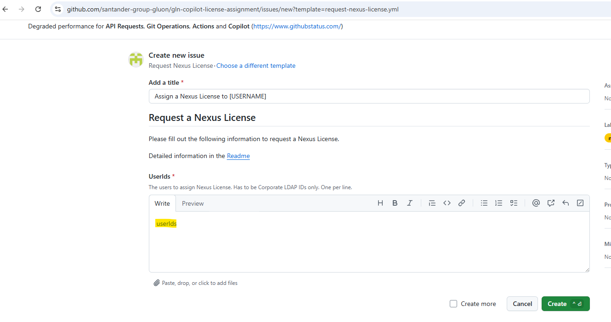
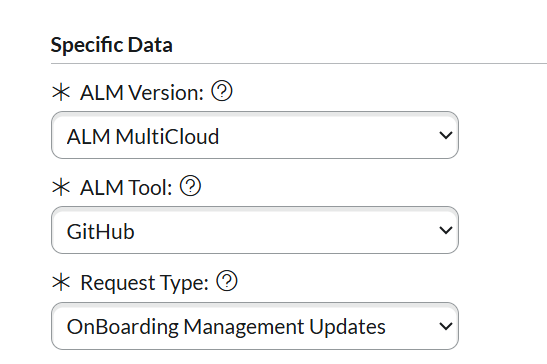
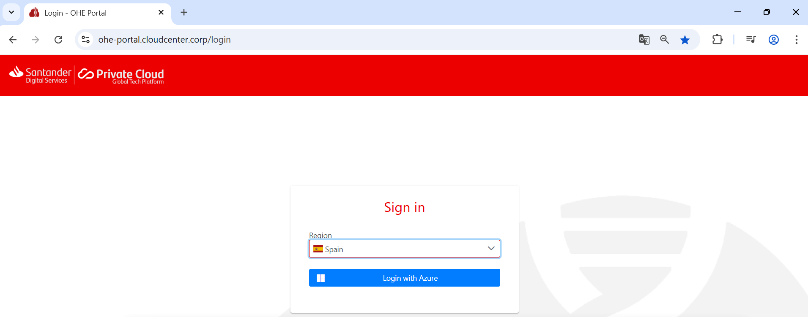
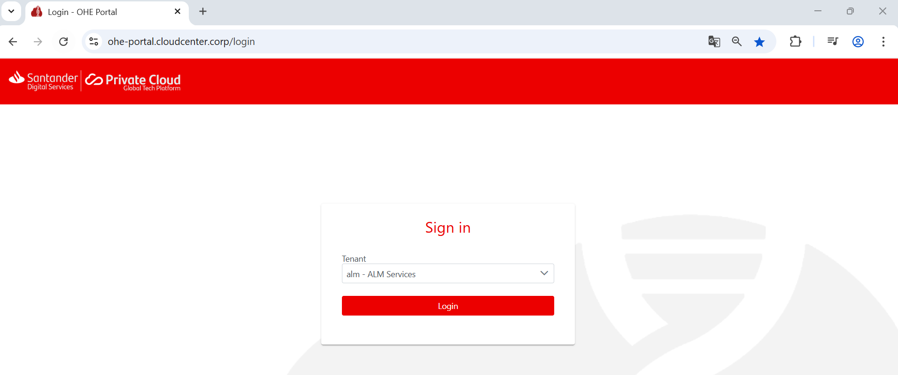
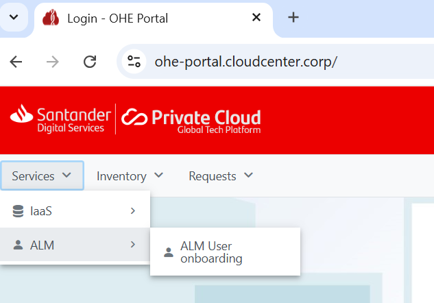
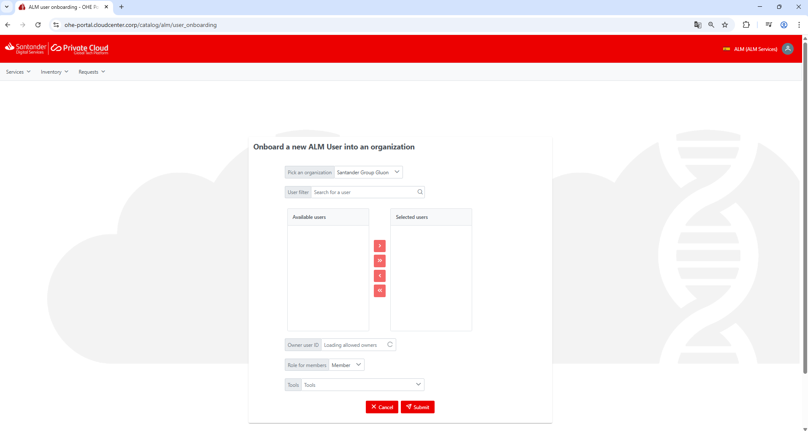

## NEXUS LICENSE

Below are the processes related to license assignment in Nexus.

### Request Nexus License

You can request Nexus License inside this issue: [Request Nexus License](https://github.com/santander-group-gluon/gln-copilot-license-assignment/issues/new/choose)
You have to include your userid in this issue.
 
{width=800px}

### [Portal OHE](https://ohe-portal.cloudcenter.corp/login)

To perform this operation, you must have the appropriate permissions. Specifically, you need to be an ALM Demand Owner of an organization and be a member of the group that grants access to the OHE Portal.
If you are not ALM Demand Owner, an ALM Demand Owner has to open a ITSM request in: [TECHNICAL CATALOG → Cloud → Private → C3 ALM Tools request](https://santander.service-now.com/now/nav/ui/classic/params/target/com.glideapp.servicecatalog_cat_item_view.do%3Fv%3D1%26sysparm_id%3D0a315c93dbf623009315453f2996194e%26sysparm_processing_hint%3Dsetfield%3Arequest.parent%253d%26sysparm_link_parent%3D8d59159bdb82af008eae18fe3b96195b%26sysparm_catalog%3D719aafd0db031f448c6c7cde3b9619f8%26sysparm_catalog_view%3Dcatalog_technical_catalog)

{width=300px}

It is essential to follow the steps described in the attached images.

{width=600px}

Select Region and Login with Azure, Tenant = alm - ALM Services and Login

{width=600px}

Select Services > ALM > ALM User onboarding

{width=350px}

Select organization, user id, owner, member and you have to select Tools = Nexus Sonatyper

{width=6500px}

### Via API

A person with permissions in [API User Onboarding](https://apis.alm.europe.cloudcenter.corp/apiuser/) can request the assignment of a user's license and its approval. To do this, they must use the following methods: 
1.**Request Tool for a Member** POST ​/organizations​/{organizationId}​/members​/{organizationMemberId}​/tools  
2.**Approve organization member tool** POST ​/organizations​/{organizationId}​/members​/{organizationMemberId}​/tools​/{organizationMemberToolId}​/approve
