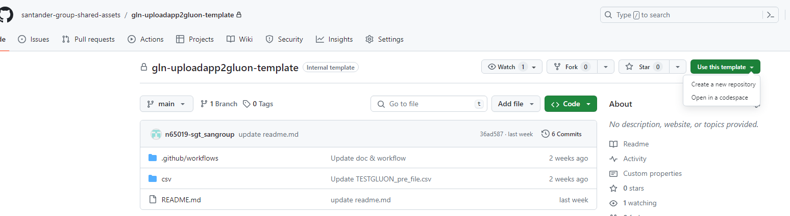
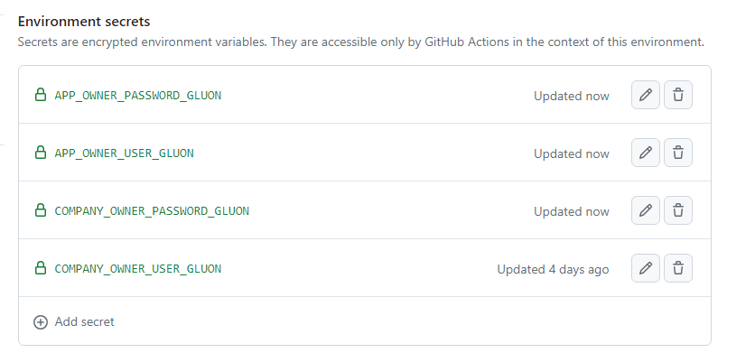
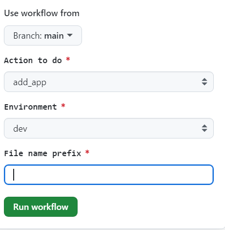
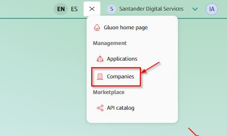
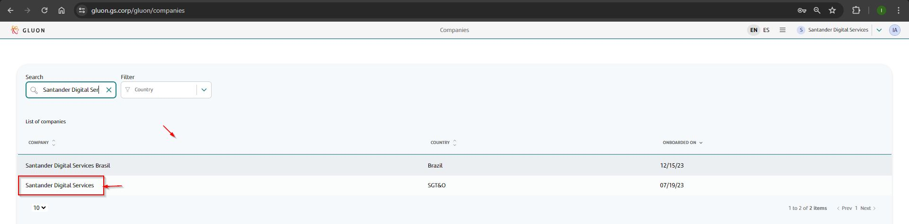
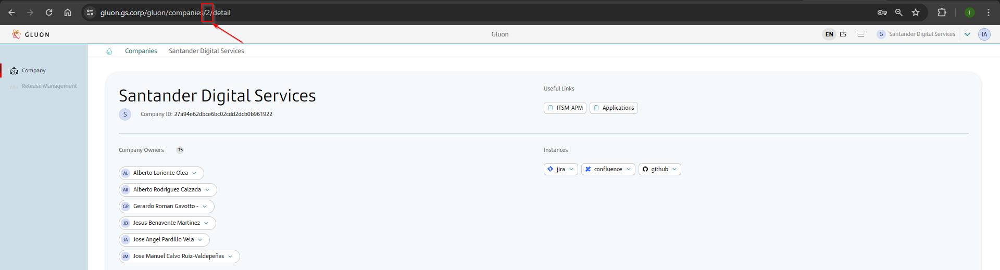
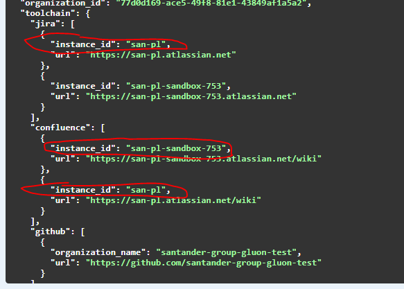

# Loading application and users

## Introduction

We have made a utility in order to facilitate the bulk uploading of applications into Gluon. This utility includes the following functionalities:

  - Register a set of applications.
  - Register the owners for each application.
  - Register the members of the application with their specific role.

## Template

In order to use the utility you will have to perform the following steps:

### Create repo

Create a repository in your organization using the following [template](https://github.com/santander-group-shared-assets/gln-uploadapp2gluon-template).



### Set secrets

It's necessary to create the corresponding environments (dev, pre and pro) with the following secrets:



### Configure  the input parameters

There are three types of files, depending on the [actions](#actions) to be carried out, one or the other will have to be configured.

#### Registration applications and owners

These files must be named as follows [NAME]_[ENVIRONMENT]_file.csv. Where [ENVIRONMENT] is "dev", "pre" or "pro".

```csv
company;short_name;technical_application;jira;confluence;github;owner1;owner2
2;AC;800008633;san-pl-sandbox-753;san-pl-sandbox-753;santander-group-gluon-test;n76790;n525530
2;ACX;800018201;san-pl-sandbox-753;san-pl-sandbox-753;santander-group-gluon-test;n382305;n525530
```

#### Registration of user and roles

These files must be named as follows [NAME]_[ENVIRONMENT]_team_members.csv

```csv
company;technical_application;oasis_name;userid;role
5;800018201;cib-acx;n220984;"[""developer""]"
5;800008633;cib-ac;n382305;"[""developer"", ""technical-lead""]"
5;800018201;cib-acx;n382305;"[""technical-lead"", ""product-owner"", ""developer""]"
```

#### Registration of applications, owners and team

These files must be named as follows [NAME]_[ENVIRONMENT]_team.csv

```csv
company;short_name;technical_application;jira;confluence;github;owner1;owner2;alm_team;location_alm_team
3;CYBURD;100051659;san-pl-sandbox-753;san-pl-sandbox-753;santander-group-gluon-test;n65019;n379100;GR_ALMNXTGN_NGITDPLATF_DEVSECOPS_SME;ALMNXTGN
3;CYBSIR;100051658;san-pl-sandbox-753;san-pl-sandbox-753;santander-group-gluon-test;n65019;n379100;sgt_devsecops_sme;ALMMC
```

???+ note

    Changes to the configuration files will be applied to a new branch. From which you will be able to start the workflow.

Where:

- **company**, short name of the Company. [How to discover id company](#how-to-discover-id-company).
- **short_name**, alias that identifies the application. This alias can have a maximum of 7 characters consisting of letters and numbers. Each application has a unique alias within the company.
- **technical_application**, uhis code corresponds to an application that is registered on the ITSM platform. [How to discover the target application identifier](../../../../application/application-management/application-onboard.md#how-to-discover-the-target-application-identifier).
- **confluence**, confluence instance reference. [How to get reference to corporate tools](#how-to-get-reference-to-corporate-tools).
- **jira** Jira instance reference. [How to get reference to corporate tools](#how-to-get-reference-to-corporate-tools).
- **github** GitHub instance reference. [How to get reference to corporate tools](#how-to-get-reference-to-corporate-tools).
- **owner1 and owner2**,  at least two company owners must be added.
- **alm_team**, Name of the group of the ALM.
- **location_alm**, it can be ALMMC or ALMNXTGN.

### **Workflows**

This repository includes a workflow with the above-mentioned functionalities, starts on demand and has the following input parameters



#### Actions

- **add_app** registers the applications specified in the [csv file](#registration-applications-and-owners)
- **add_owners** registers the applications owner specified in the [csv file](#registration-applications-and-owners).
- **add_roles** adds the members to the application team with the roles specified in the [csv file](#registration-applications-and-owners).
- **full_process** registers the applications, the owners and teams from [csv file](#registration-of-applications-owners-and-team).
- **sync_groups** synchronises the equipment of an application from the alm group specified in the [csv file](#registration-of-applications-owners-and-team)
- **get_companies** returns the id of the companies registered in Gluon.

If you have an ALM group, you can upload in a single step with the "full_process" action.

If you do not have an ALM user, you will have to perform the following steps:

1. Register the applications with the "add_app" action,
2. Register the owners with the "add_owner" action,
3. Register the equipment with the "add_roles" action.

???+ note

    Even if owner appears with another role in the ALM group, they will not be registered as a member of the team.

#### Environment

Specify the Gluon environment where you want to charge (dev, pre, pro).

## How to discover id company

There are two ways to obtain the company's identifier:

- Running the workflow with the get_companies [action](#actions).
- From the Gluon portal itself.





## How to get reference to corporate tools

You can obtain references to corporate tools from the Management API ([dev](https://gluon.dev.corp/management), [pre](https://gluon.pre.corp/management), [pro](https://gluon.gs.corp/management)).

For them you will have to perform the following steps:

- Call the /api/v1/companies method to get the company identifier.
- Call the  /api/v1/companies/{id} to get the toolchain.


