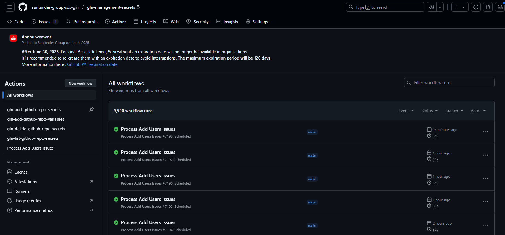
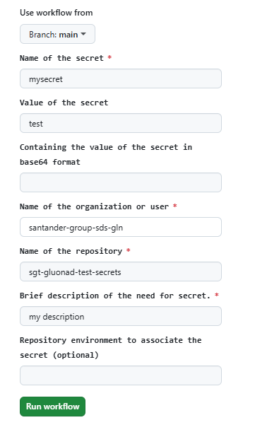
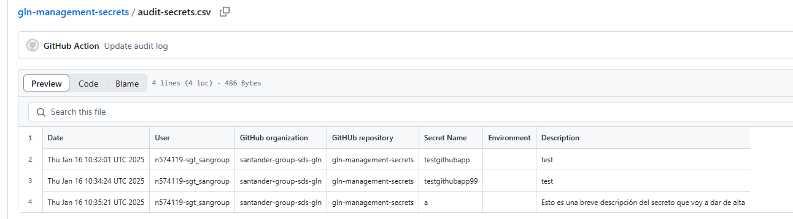

# Secret Management Repository for SDS

## Overview

This utility contains a self-service service that allows managing secrets for all repositories within SDS.

Additionally, the repository contains a utility (GitHub issue) that, through a workflow that runs every 30 minutes, allows us to grant write permissions to the repository.
The only requirement is that our user must be previously registered in a Gluon application (inside SDS) as a developer or TL.

[GitHub Repository](https://github.com/santander-group-sds-gln/gln-management-secrets)

## Functionality

This repository primarily contains five workflows, each designed with a distinct functionality:

- **gln-add-github-repo-secrets:** This workflow enables the addition of secrets to a repository within the SDS organization, contingent upon the user possessing the necessary permissions for the repository.
- **gln-add-github-repo-variables:** This workflow facilitates the addition of variables to a repository within the SDS organization, also requiring the user to have appropriate permissions for the repository.
- **gln-add-github-delete-secrets:** This workflow allows the deletion of secrets from a repository within the SDS organization, provided the user has the required permissions for the repository.
- **gln-list-github-repo-secrets:** This workflow provides a listing of secrets within a repository of the SDS organization, displaying only the secret ID. This function is also subject to the user having the necessary permissions for the repository.
- **process_issues:** This workflow grants write permissions to the user within this repository via an issue. These permissions are required to execute the aforementioned workflows.

## Requisites

It is necessary to have a installed githubAPP with following permissions:

Repository Permission

 - Actions: Read & Write
 - Administration: Read & Write
 - Checks: Read & Write
 - Commit statuses: Read & Write
 - Contents: Read & Write
 - Environments: Read & Write
 - Issues: Read & Write
 - Merge queues: Read & Write
 - Metadata: Read
 - Pull Request: Read & Write
 - Secrets: Read & Write
 - Workflows: Read & Write

Organization Permission

 - Administration: Read & Write
 - Custom Organization roles: Read
 - Members: Read & Write

## Input Parameters

- `name`: The name of the secret. This is a required parameter.
- `value`: The value of the secret. This is a required parameter.
- `org`: The name of the organization or user. This is a required parameter.
- `repo`: The name of the repository. This is a required parameter.
- `description`: Brief description of the need for secret. This is a required parameter.
- `env`: The repository environment to associate the secret with. This is an optional parameter.

## Secrets

The workflow requires the following secrets to be set in the repository:

- `APP_ID`: The ID of your GitHub App. This is used to authenticate as the app and generate an installation access token.
- `APP_PRIVATE_KEY`: The private key of your GitHub App. This is used along with the `APP_ID` to authenticate as the app.

## Functional Documentation

This GitHub Actions workflow is designed to execute a Python script that interacts with GitHub secrets.
The workflow is triggered manually (`workflow_dispatch`) and requires several inputs: the name and value of the secret,
the name of the GitHub organization or user, the name of the repository, and optionally, the environment associated with the secret.

## Usage

To use this workflow, you need to set the required secrets (`APP_ID`, `APP_PRIVATE_KEY`) in your repository settings. Then, you can trigger the workflow manually from the Actions tab in your repository.
You will need to provide the input parameters (`name`, `value`, `org`, `repo`,`description` `env`) when triggering the workflow.

## Concurrency

Two jobs cannot be executed simultaneously in the same organization to prevent the repository audit from being generated correctly.
If we execute several JOBs simultaneously, they will remain queued, and will be executed in the order in which they have been launched.

## Audit

The process generates a file called audit-secret.csv in the audit-log branch in this repository, with the audit of all the executions that are generated.

## Permission in repository

To grant yourself write permissions in the repository, follow the actions described in this [README file](https://github.com/santander-group-sds-gln/gln-management-secrets/blob/main/README_process_issues.yaml).
