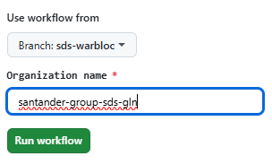
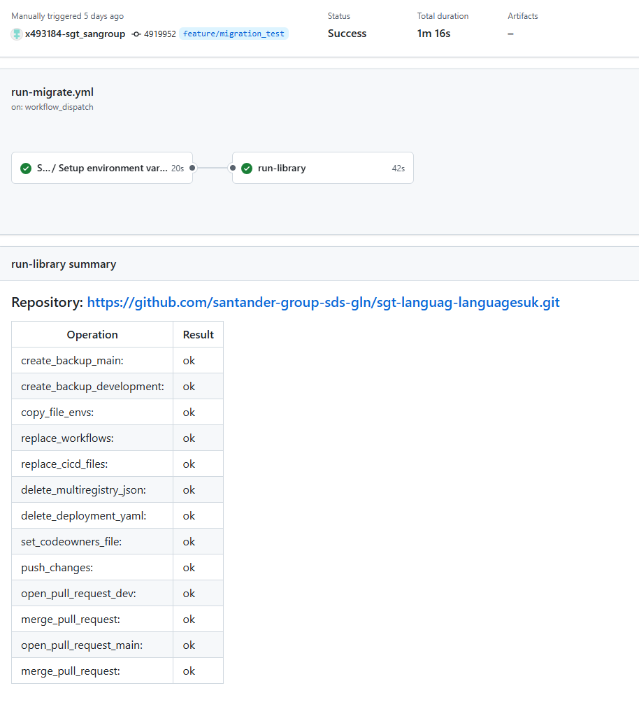
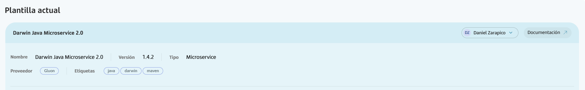

# What's?

There is a new utility to facilitate the mass migration of legacy 1.0 components (without OAM) to the new 2.0 standard (with OAM).  
Currently, this utility supports the following component types:

- Darwin Java Microservices
- Arsenal Java Microservices
- Configmap
- Secrets
- Darwin Microfront
- Darwin SPA
- React SPA
- React Microfront

## Prerequisite

The Gluon Application Model component must be created before running the migration utility.

## How to Use This Feature?

### Enablement

1. An organization owner must create a new repository from [`@santander-group-shared-assets/sgt-compmig`](https://github.com/santander-group-shared-assets/sgt-compmig).
2. Create a company team in the Gluon portal and assign users who will run the migration utility.
3. Add this new team to the repository created in step 1.

### Configure

- **Create a branch from `main`**
- **Configure your migration batch**  
   Update `resources/components.csv` with the repository URLs and OAM IDs to migrate.  
   Format per line:  

   ```csv
   git_url,id_oam_dev,id_oam_pre,id_oam_pro
   ```

   Example:  
  
   ```csv
   https://github.com/santander-group-spain-gln/san-vadeca-valcatalogue.git,CI0000000137,CI0000000138,CI0000000138
   ```

### Run the migration workflow

   - Go to the "Actions" tab.
   - Execute the workflow named **"Run migrator library"**.
   - Select the branch and the owning organization.

      

### Review the migration summary

   - After completion, a summary with processed repositories and their migration status will be shown.
      

### Verify in Gluon Portal

   - Confirm that the template has changed for each migrated component.
      

## Migration Steps Per Template

For each component type, a set of automated migration steps are performed. For detailed steps per template, see [README](https://github.com/santander-group-shared-assets/sgt-compmig?tab=readme-ov-file#templates-and-performed-operations)

---

## Potential Impact or Risks

- Branches and backups are created for safety, but always validate the migration in a test environment before merging to production.
- Any custom modifications outside the standard structure may require additional manual review post-migration.
- Ensure there are no pending developments to be uploaded prior to migration, as the folder structure and workflows will be changed.
  If there are any, either upload them before migration or ensure that only the modified software is uploaded after migration to avoid inconsistencies.
